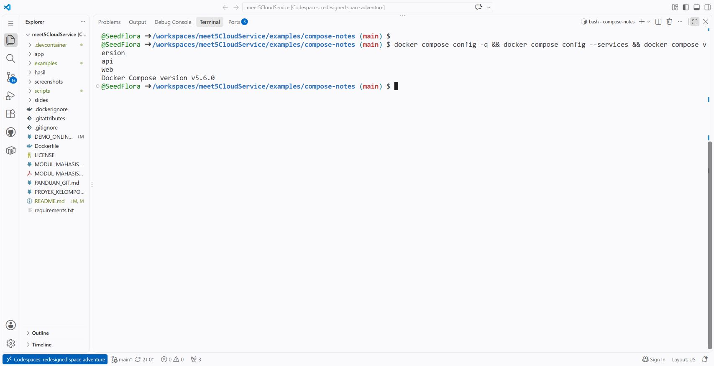
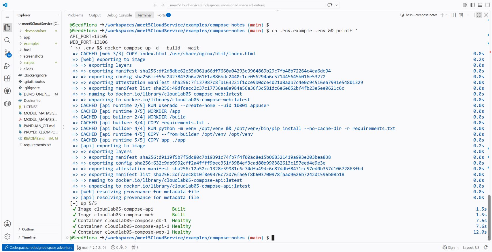
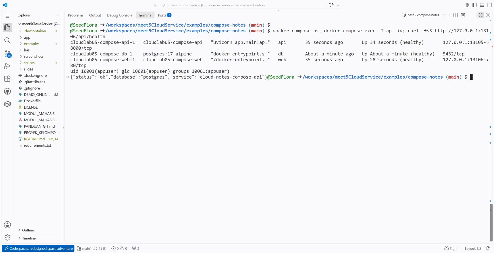
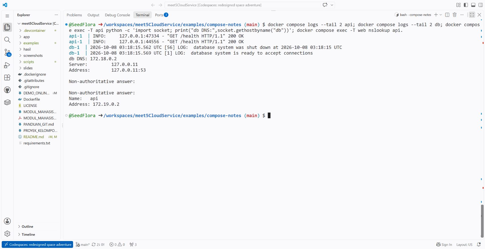
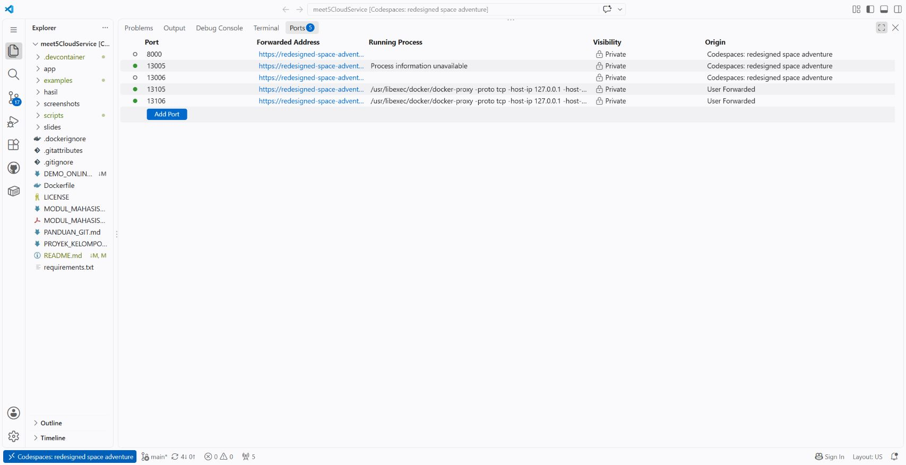
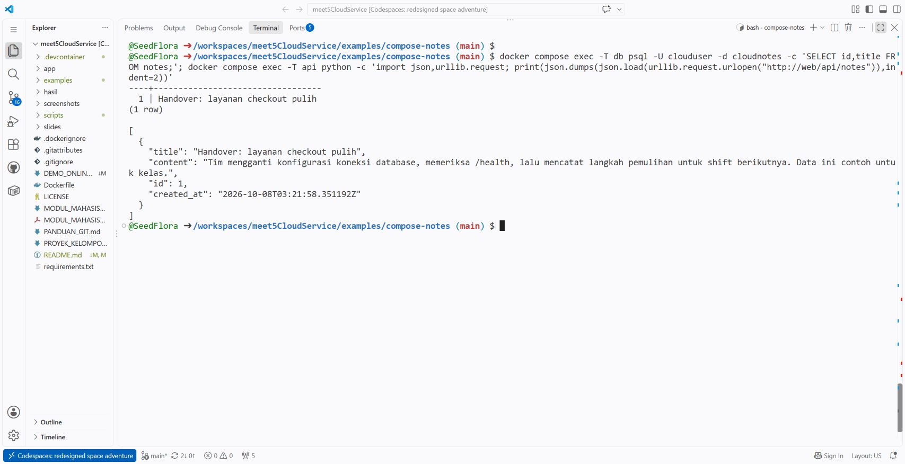
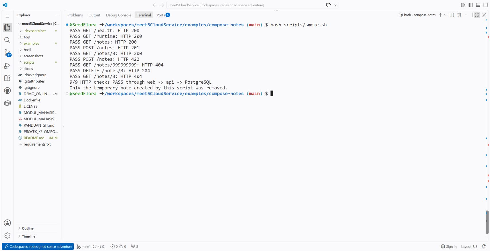
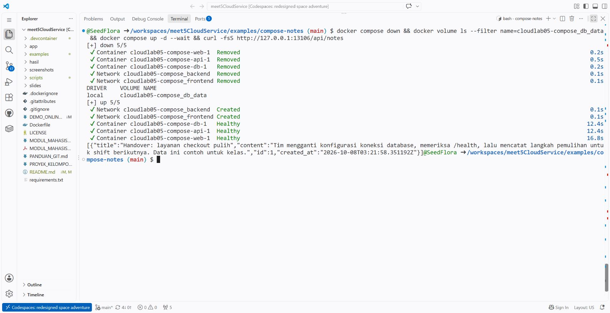
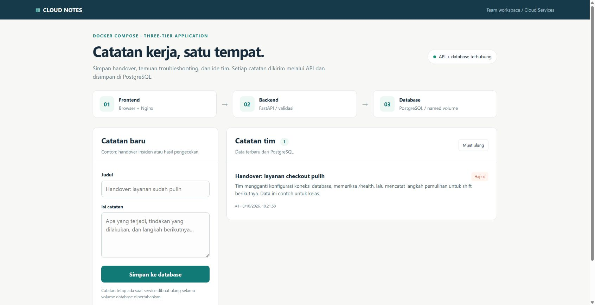
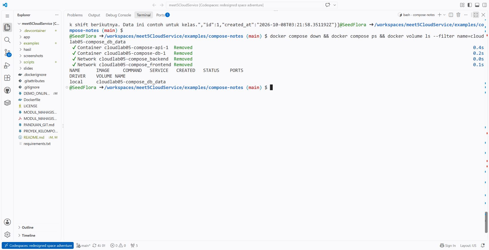

# Demo Compose — frontend, backend, dan PostgreSQL

**Kasus kerja harian:** anggota tim mendapat aplikasi Cloud Notes dan ingin menjalankan frontend, API, serta database dengan konfigurasi yang dapat dibaca dan diulang bersama. Dockerfile menyiapkan image tiap aplikasi; Compose menyatukan cara menjalankan service, network, konfigurasi, dan volume.

Demo ini jembatan dari teori Docker Week 05 ke Lab 06 dan proyek kelompok. Ini **latihan formatif bersama**, tanpa tugas, nilai, atau penyerahan terpisah. Proyek tetap kelompok **3 mahasiswa**, dengan presentasi minggu **7 (UTS)** dan **14 (UAS)**. Semua pertanyaan diskusi beserta kunci tersedia di bawah.

## 1. Dua contoh yang sengaja berbeda

| Contoh | Port host | Penyimpanan | Kegunaan belajar |
|---|---|---|---|
| API utama Lab 05, `cloud-notes-api:theory-online` | 8000 | Dict Python dalam memori | Dockerfile, build/run, validasi, dan data hilang saat proses restart. |
| API Compose di `examples/compose-notes` | 13005 → container 8000 | PostgreSQL | Backend berkomunikasi dengan database melalui DNS service. |
| Frontend Compose, service `web` | 13006 → container 80 | Menggunakan API | Browser membuat dan membaca catatan melalui Nginx. |
| Database Compose, service `db` | **Tidak dipublikasikan ke host** | Named volume | PostgreSQL menerima koneksi internal pada port 5432. |

Kode Compose adalah contoh terpisah. Dockerfile/API memori Lab 05 tetap tersedia. Image yang diperiksa pada demo Scout utama adalah image API memori, sehingga jangan menyamakan nama tag atau hasil scannya dengan image backend Compose.

**Alamat pada screenshot online:** pengujian Codespaces kelas memakai API **13105** dan web **13106**, karena port 13005 sudah dipakai proses lain yang dipertahankan. Nilai default repo tetap API 13005/web 13006. Port di dalam container tidak berubah: API 8000, web 80, database 5432. Bagian berikut menunjukkan cara memilih port; URL browser dan curl harus mengikuti pilihan yang sama.

**Alur request:** browser membuka frontend → request relatif `/api/notes` → Nginx meneruskan ke `api:8000` → FastAPI membaca/menulis PostgreSQL pada `db:5432`. Nama `api` dan `db` ditemukan melalui DNS network Compose, bukan alamat IP yang harus dihafal. Database tidak memerlukan forwarding publik. [Networking Compose](https://docs.docker.com/compose/how-tos/networking/)

## 2. Persiapan: browser atau mesin lokal

**Jalur online:** buka repo [meet5CloudService](https://github.com/SeedFlora/meet5CloudService), pilih Code → Codespaces, gunakan konfigurasi repo dan mesin 2 core. Tunggu terminal Linux serta daemon Docker siap. Laptop hanya memerlukan browser, akun GitHub, internet, dan kuota; Docker berjalan di mesin cloud. Waktu provisioning/unduhan di luar waktu show kelas. Jangan memakai editor ringan `github.dev` sebagai pengganti Codespaces.

**Jalur lokal:** gunakan Docker Desktop/Engine yang sudah berjalan. Port **13005** dan **13006** harus kosong. Untuk command Bash, gunakan terminal Linux/WSL atau Git Bash; perintah Docker Compose juga dapat dijalankan di PowerShell.

Dari root repo:

```bash
docker version
docker compose version
cd examples/compose-notes
```

Seluruh command Compose berikut dijalankan dari folder **`examples/compose-notes`**, supaya Compose membaca `compose.yaml` dan `.env` yang benar.

### Salin konfigurasi khusus kelas

Bash:

```bash
cp .env.example .env
```

PowerShell:

```powershell
Copy-Item -LiteralPath .env.example -Destination .env
```

File contoh memakai database `cloudnotes`, user `clouduser`, dan password **`classroom-demo-only-change-me`**. Password ini sengaja diketahui semua orang, hanya untuk data dummy pada demo terisolasi; jangan dipakai pada sistem kerja atau layanan produksi. `.env` diabaikan Git. Ganti secret pada sistem nyata melalui mekanisme secret yang sesuai, lalu hindari menampilkan nilainya pada presentasi atau commit. `docker compose config` dapat menampilkan nilai environment yang sudah disubstitusi; gunakan `--quiet` untuk pemeriksaan syntax tanpa mencetak semuanya.

### Pilih port sebelum menjalankan service

Default lokal memakai API **13005** dan web **13006**. Untuk mengikuti screenshot online atau menghindari benturan port, jalankan di terminal Linux setelah menyalin `.env`:

```bash
sed -i 's/^API_PORT=.*/API_PORT=13105/; s/^WEB_PORT=.*/WEB_PORT=13106/' .env
```

**Fungsi:** mengganti baris `API_PORT` dan `WEB_PORT` yang memang sudah ada pada file contoh. Tidak mengubah port aplikasi di dalam container atau mematikan proses lain. Jalankan sebelum `up`; jika service sendiri sudah dibuat pada port lama, recreate service melalui `docker compose up -d --build --wait` setelah konfigurasi diperbarui. Jangan mengubah port sambil tetap menggunakan URL lama.

Agar command curl pada panduan mengikuti port yang dipilih, baca nilainya dari `.env` pada **terminal Bash yang sama**:

```bash
API_HOST_PORT="$(sed -n 's/^API_PORT=//p' .env | tail -n 1)"
WEB_HOST_PORT="$(sed -n 's/^WEB_PORT=//p' .env | tail -n 1)"
printf 'Port host API=%s; frontend=%s\n' "$API_HOST_PORT" "$WEB_HOST_PORT"
```

File contoh menyediakan kedua baris port sebagai angka tanpa quote. Jika membuka terminal baru, jalankan tiga baris tersebut lagi. Variabel Bash ini hanya membantu command curl; mapping Docker ditentukan oleh `.env`, bukan oleh dua variabel tersebut. Pengguna PowerShell dapat memakai URL literal sesuai `.env`, misalnya `curl.exe -i http://127.0.0.1:13105/health` untuk alternatif online.

```bash
docker compose config --quiet
```

**Fungsi:** memeriksa apakah Compose dapat membaca model dan variabelnya. **Cara membaca:** exit sukses tanpa pesan bukan berarti aplikasi sudah berjalan; ini baru pemeriksaan konfigurasi. `docker compose config --services` dapat menunjukkan nama `web`, `api`, dan `db` tanpa menampilkan password.

<!-- compose-screenshot-01:start -->



*Screenshot aktual 8 Oktober 2026. Command: `docker compose config -q`, `docker compose config --services`, dan `docker compose version`. Fungsi: memvalidasi model tanpa mencetak secret, mengenali nama service, serta versi Compose. Config berhasil kembali ke prompt; ini belum menjalankan aplikasi. Versi pada uji ini v5.6.0; versi pada mesin lain dapat berbeda.*

<!-- compose-screenshot-01:end -->

## 3. Build dan jalankan tiga layanan

```bash
docker compose up -d --build --wait
```

- `up`: membuat dan menjalankan service sesuai model Compose.
- `--build`: membangun image aplikasi sebelum memulai service yang memerlukannya.
- `-d`: menjalankan service di background agar terminal kembali menerima command.
- `--wait`: menunggu service berstatus running/healthy sesuai healthcheck yang tersedia. Ini tetap perlu dilengkapi pengujian HTTP, penulisan, serta pembacaan catatan.

Compose memiliki healthcheck untuk database/API/web dan dependency kesiapan agar startup tidak hanya bergantung pada urutan proses dibuat. Aplikasi tetap perlu menangani kegagalan koneksi selama operasional. [Startup order](https://docs.docker.com/compose/how-tos/startup-order/), [Compose up](https://docs.docker.com/reference/cli/docker/compose/up/)

<!-- compose-screenshot-02:start -->



*Command utama: `docker compose up -d --build --wait`, setelah memilih API_PORT=13105 dan WEB_PORT=13106 dalam `.env`. Fungsi: membuild image API/web dan menjalankan tiga service. Baca hasil: image Built serta container db/api/web Healthy. Screenshot memakai penambahan nilai port pada akhir `.env`; panduan menggunakan `sed` untuk mengganti baris yang sudah ada agar file lebih mudah dibaca. Kedua alur memilih port host alternatif yang sama.*

<!-- compose-screenshot-02:end -->

## 4. Baca status, log, dan batas network

```bash
docker compose ps
docker compose logs --tail 20 api
docker compose logs --tail 20 db
docker compose logs --tail 20 web
docker compose exec -T api id
```

**Yang diperiksa:** tiga service berjalan, status healthcheck yang ditampilkan, publish API **13005:8000** dan web **13006:80** secara default, atau **13105:8000/13106:80** untuk alternatif screenshot, serta tidak ada mapping port database ke host. Mapping API/web memakai loopback host `127.0.0.1`; Codespaces kemudian meneruskannya melalui tab Ports. PostgreSQL dapat menampilkan `5432/tcp` pada kolom port internal; itu berbeda dari `0.0.0.0:5432->5432/tcp`. User proses API adalah UID **10001**, sehingga aplikasi tidak dijalankan sebagai root.

Log menjelaskan aktivitas tiap service: API menerima request, database siap menerima koneksi, dan Nginx melayani frontend/proxy. Status `Up` saja belum membuktikan alur simpan/baca bekerja. [Model aplikasi Compose](https://docs.docker.com/compose/intro/compose-application-model/)

<!-- compose-screenshot-03:start -->



*Command: `docker compose ps`, `docker compose exec -T api id`, dan `curl -fsS http://127.0.0.1:13106/api/health`. Fungsi: melihat mapping dan user serta menguji request melalui frontend/proxy. Baca hasil: API 13105→8000, web 13106→80, db hanya 5432/tcp internal, UID 10001, serta status ok/database postgres. API `/health` menjalankan `SELECT 1` ke database sebelum memberi respons ok.*

<!-- compose-screenshot-03:end -->

### DNS service: nama lebih stabil daripada IP

```bash
docker compose exec -T api python -c 'import socket; print("db DNS:", socket.gethostbyname("db"))'
docker compose exec -T web nslookup api.
```

**Fungsi:** API meresolusikan nama database `db`; web meresolusikan nama backend `api`. Python dijalankan **di container API**, bukan mensyaratkan Python pada laptop/host. `-T` menonaktifkan alokasi terminal interaktif untuk command singkat. Titik akhir pada `api.` membuat query DNS absolut sehingga `nslookup` tidak mencoba menambahkan search suffix milik lingkungan cloud. Konfigurasi aplikasi tetap memakai nama service `api` dan `db`; jangan menggantinya dengan IP screenshot.



*Command: `docker compose logs --tail 2 api`, `docker compose logs --tail 2 db`, lalu dua command DNS di atas. Fungsi: menghubungkan kesiapan layanan dengan komunikasi antarcontainer. Pada snapshot, API menemukan db pada 172.18.0.2 dan web menemukan api pada 172.19.0.2; IP bukan nilai tetap dan dapat berubah ketika service/network dibuat kembali. Server DNS 127.0.0.11 adalah resolver embedded Docker pada network container ini.*

## 5. Tampilkan frontend dan Swagger

**Di Codespaces:** buka tab Ports, forward port host yang dipilih dalam `.env`: **13006/13005** secara default atau **13106/13105** pada screenshot online. Tambahkan port secara manual bila belum terlihat, pertahankan visibility **Private**, lalu Open in Browser. Gunakan URL forwarding yang benar-benar ditampilkan, tanpa menebak nama Codespace.

- **Frontend:** URL port 13006, path `/`.
- **Swagger:** URL port 13005, tambahkan `/docs`.
- **Di laptop lokal:** `http://127.0.0.1:13006/` dan `http://127.0.0.1:13005/docs`.

Untuk alternatif screenshot, frontend memakai port **13106** dan Swagger/API **13105**. Browser Codespaces memakai URL forwarding port tersebut; jangan mengetik localhost laptop.

Pada terminal Codespaces, `127.0.0.1` menunjuk mesin cloud. Pada browser laptop, alamat yang sama menunjuk laptop, sehingga akses online harus menggunakan URL tab Ports. Request frontend memakai path relatif `/api/*`; browser tidak perlu memanggil alamat internal `api:8000` atau `db:5432`. Nginx di dalam network Compose yang meneruskan request ke backend.

<!-- compose-screenshot-04:start -->



*Langkah: Ports → Add Port 13105 dan 13106 → Visibility Private → Open in Browser. Fungsi: menghubungkan browser laptop dengan port host Codespaces. Baca hasil: kedua port alternatif diteruskan, sementara port 13005 yang sudah dipakai proses lain tetap ada. Tidak ada forwarding port database. URL forwarding ini lapisan tambahan setelah publish port Docker.*


*Langkah: buka URL port 13106 dari tab Ports, path `/`. Fungsi: menampilkan frontend dan koneksi ke backend/database. Baca hasil: indikator API + database terhubung dan daftar belum ada catatan. Indikator berasal dari request `/api/health`; isi daftar berasal dari PostgreSQL melalui API, bukan data palsu dalam HTML.*

<!-- compose-screenshot-04:end -->

## 6. Simpan dan baca catatan end to end

Pada halaman frontend, isi judul **`Demo Compose kelas`** dan isi **`Data ini disimpan pada PostgreSQL.`**, lalu gunakan tombol penyimpanan. Catatan harus muncul pada daftar setelah request berhasil. Tampilkan Swagger `/health` dan `/runtime` untuk menghubungkan antarmuka dengan backend serta jenis storage.

Padanan pengujian pada terminal **Bash/Linux**; pada PowerShell gunakan `curl.exe` untuk memilih curl asli:

```bash
curl -i "http://127.0.0.1:${API_HOST_PORT}/health"
curl -i "http://127.0.0.1:${API_HOST_PORT}/runtime"
curl -i -X POST "http://127.0.0.1:${WEB_HOST_PORT}/api/notes" \
  -H 'Content-Type: application/json' \
  -d '{"title":"Demo Compose terminal","content":"Browser dan terminal menggunakan backend yang sama."}'
curl -i "http://127.0.0.1:${WEB_HOST_PORT}/api/notes"
curl -i "http://127.0.0.1:${API_HOST_PORT}/notes"
```

**Fungsi:** GET health/runtime memeriksa API dan identitas storage; POST melalui port web menguji proxy serta penyimpanan; GET melalui web dan port API menguji pembacaan backend yang sama. **Hasil yang diharapkan:** HTTP **200** untuk GET, HTTP **201** untuk pembuatan catatan, `/runtime` memakai `storage: postgres` dan host database `db`, serta catatan yang dibuat ada di daftar. ID dan urutan catatan dapat berbeda. Periksa isi respons, bukan status saja.

Validasi tambahan bersama dosen:

```bash
curl -i -X POST "http://127.0.0.1:${WEB_HOST_PORT}/api/notes" \
  -H 'Content-Type: application/json' \
  -d '{"title":"   ","content":"Contoh input ditolak."}'
curl -i "http://127.0.0.1:${API_HOST_PORT}/notes/0"
```

**Kunci:** judul spasi saja harus ditolak **422**; ID 0 yang tidak dibuat aplikasi menghasilkan **404**. Itu respons validasi/route yang diharapkan, bukan tanda container rusak. Backend juga menyediakan DELETE `/notes/{id}` dengan respons **204** untuk ID yang ada; penghapusan data tidak diperlukan pada demonstrasi persistensi di bawah.

<!-- compose-screenshot-05:start -->


*Langkah: isi form lalu klik **Simpan ke database** pada frontend port 13106. Cara kerja: JavaScript POST `/api/notes`; Nginx meneruskan ke FastAPI; backend INSERT ke PostgreSQL; frontend GET daftar kembali. Snapshot menunjukkan catatan **Handover: layanan checkout pulih**, ID 1, sebagai data dummy. Contoh teks pada latihan boleh berbeda; ID bergantung data yang sudah ada. Teks UI saja perlu dilengkapi bukti API/SQL dan persistensi di langkah berikutnya.*

<!-- compose-screenshot-05:end -->

### 6.1 Bandingkan respons API dengan baris SQL

Pada terminal yang sama, jalankan pemeriksaan baca saja:

```bash
docker compose exec -T db psql -U clouduser -d cloudnotes \
  -c 'SELECT id, title FROM notes ORDER BY id;'
docker compose exec -T api python -c \
  'import json, urllib.request; print(json.dumps(json.load(urllib.request.urlopen("http://web/api/notes")), indent=2))'
```

**Fungsi:** command pertama membaca tabel pada PostgreSQL menggunakan `psql` di container database. Command kedua menjalankan Python di container API untuk melakukan GET melalui service `web`; hasilnya memperlihatkan JSON yang disajikan Nginx → FastAPI → PostgreSQL. Keduanya memakai program dalam container, sehingga Python atau PostgreSQL client tidak perlu dipasang pada host Codespaces. User/database di sini mengikuti nilai contoh; sesuaikan bila sengaja mengubah `.env`.

**Kunci membaca:** ID dan judul pada SQL harus sesuai dengan data pada JSON. Ini menghubungkan form browser dengan penyimpanan sebenarnya. Jangan mengubah tabel untuk sekadar membuat hasil cocok, dan jangan memakai SQL untuk menghapus catatan yang sedang dipakai demo persistensi.



*Command aktual: `docker compose exec -T db psql -U clouduser -d cloudnotes -c 'SELECT id,title FROM notes;'`, lalu `docker compose exec -T api python -c 'import json,urllib.request; print(json.dumps(json.load(urllib.request.urlopen("http://web/api/notes")),indent=2))'`. Fungsi: membuktikan catatan pada UI memiliki baris database dan dapat dibaca melalui proxy web. Cara kerja: psql SELECT baca saja; Python di container API GET melalui web/proxy dan menata JSON. Baca hasil: SQL satu baris ID 1/judul Handover: layanan checkout pulih; JSON mempunyai ID/judul yang sama. Timestamp dicatat database; waktu browser dapat mengikuti zona pengguna.*

### 6.2 Ulangi pemeriksaan dengan smoke script

Dari folder **`examples/compose-notes`**, dengan tiga service sudah berjalan:

```bash
bash scripts/smoke.sh
```

Script menjalankan Python **di container API** dan menggunakan URL internal `http://web/api`. Jadi request melewati service web/proxy → API → PostgreSQL tanpa bergantung pada Python di host atau port forwarding browser. Gunakan ini untuk memeriksa fungsi sebelum anggota tim mendemokan rilis; ini latihan bersama, bukan tugas atau penyerahan tambahan.

| Urutan | Request | Status yang diharapkan | Yang diperiksa |
|---|---|---|---|
| 1 | GET `/health` | 200 | Respons menyatakan database `postgres`; endpoint menguji koneksi database. |
| 2 | GET `/runtime` | 200 | Storage `postgres` dan proses Python pemeriksa berjalan sebagai UID 10001 di container API. |
| 3 | GET `/notes` | 200 | Daftar dapat dibaca melalui proxy web. |
| 4 | POST `/notes`, judul Temporary smoke test | 201 | Membuat **satu catatan dummy sementara** dan menyimpan ID respons. |
| 5 | GET `/notes/{ID sementara}` | 200 | Catatan baru dapat dibaca; judul sesuai data uji. |
| 6 | POST `/notes`, judul kosong | 422 | Backend menolak input yang tidak valid. |
| 7 | GET `/notes/999999999` | 404 | ID yang tidak dibuat pada data demo ini ditolak sebagai tidak ditemukan. |
| 8 | DELETE `/notes/{ID sementara}` | 204 | Hanya catatan sementara milik script dihapus. |
| 9 | GET `/notes/{ID sementara}` | 404 | Catatan yang baru dihapus tidak lagi dapat dibaca. |

**Cara kerja `request(method, path, expected, payload=None)`:** fungsi menggabungkan path dengan URL internal, mengubah payload menjadi JSON bila ada, lalu mengirim request dengan method dan header `Content-Type: application/json`. `urlopen` diberi timeout 10 detik. Python biasanya melempar `HTTPError` untuk status 4xx; script menangkap status/body tersebut agar **422 atau 404 yang sengaja diharapkan tetap dapat diuji**. Assertion membandingkan status aktual dengan status yang diharapkan. Body kosong pada 204 dibaca sebagai `None`, bukan dipaksa menjadi JSON. Kegagalan koneksi, timeout, status yang salah, atau assertion isi respons membuat command gagal dan perlu diperiksa; jangan menganggapnya hasil PASS.

**Cara kerja `try`/`finally`:** setelah POST berhasil, script menyimpan `created_id`. Bagian `finally` mencoba DELETE terhadap ID itu dan mengecek GET sesudahnya, termasuk bila pemeriksaan setelah pembuatan gagal. Ini menjaga catatan handover yang sudah ada karena script tidak menghapus seluruh tabel atau memakai ID catatan dosen. Cleanup dapat gagal bila layanan sedang tidak tersedia; bila itu terjadi, baca error dan periksa catatan sementara sebelum mencoba ulang. Ringkasan akhir hanya dicetak setelah alur serta assertion selesai; satu baris PASS status sebelum assertion isi bukan bukti seluruh script selesai.



*Command: `bash scripts/smoke.sh`. Fungsi: memeriksa operasi baca/tulis, validasi, respons tidak ditemukan, dan penghapusan melalui proxy web. Hasil aktual pada Codespaces: **9/9 HTTP checks PASS through web → api → PostgreSQL**. Catatan sementara pada snapshot mendapat ID 3 dan dihapus; ID dapat berbeda pada eksekusi lain. Catatan handover ID 1 tetap dipakai untuk uji persistensi. Hasil ini menguji alur internal service; keberhasilan tab Ports dan tampilan browser dibuktikan terpisah oleh screenshot frontend.*

## 7. Buktikan persistensi: down, lalu up

Pastikan setidaknya satu catatan terlihat sebelum menghentikan service. Jangan menjalankan langkah ini pada service atau database di luar project demo.

```bash
curl -fsS "http://127.0.0.1:${API_HOST_PORT}/notes"
docker compose down
docker volume inspect cloudlab05-compose_db_data
docker compose up -d --wait
curl -fsS "http://127.0.0.1:${API_HOST_PORT}/notes"
```

**Cara kerja:** `down` menghapus container dan network project, tetapi named volume dipertahankan. Saat service dibuat kembali dengan nama project yang sama, PostgreSQL menggunakan data pada volume yang sama. Catatan tetap muncul meskipun container baru dibuat; ini berbeda dari dict memori pada API utama Lab 05. Nama default project contoh ini adalah **`cloudlab05-compose`**, sehingga volume bernama **`cloudlab05-compose_db_data`**. Mengganti project name dapat membuat volume lain dan tampak seperti data hilang.

**Kunci:** hasil setelah up harus masih memuat catatan yang sudah dibuat. Jika data tidak muncul, periksa project name, volume yang dipakai, log database, dan apakah sebelumnya ada penghapusan volume atau catatan. Named volume menyimpan data pada mesin Docker itu; volume bukan backup, dan tidak otomatis disalin ke GitHub atau laptop ketika Codespace dihapus. [Volumes](https://docs.docker.com/engine/storage/volumes/), [Compose down](https://docs.docker.com/reference/cli/docker/compose/down/)

<!-- compose-screenshot-06:start -->



*Command aktual: `docker compose down`, `docker volume ls --filter name=cloudlab05-compose_db_data`, `docker compose up -d --wait`, lalu `curl -fsS http://127.0.0.1:13106/api/notes`. Fungsi: membuktikan data bertahan setelah container/network dibuat kembali. Baca hasil: container Removed, named volume tetap terdaftar, tiga service kembali Healthy, dan JSON tetap berisi catatan handover ID 1. Panduan memakai `docker volume inspect` sebagai pemeriksaan volume yang lebih rinci; keduanya adalah pemeriksaan baca saja.*



*Langkah: setelah up selesai, buka kembali frontend port 13106 dan klik **Muat ulang** atau reload halaman. Fungsi: memeriksa hasil persistensi dari sudut pengguna browser. Baca hasil: API + database terhubung, judul/isi handover dan ID 1 tetap muncul. Gabungkan bukti UI ini dengan down/up dan respons API di screenshot sebelumnya; tampilan yang tidak dimuat ulang saja belum membuktikan data bertahan.*

<!-- compose-screenshot-06:end -->

## 8. Cleanup setelah demo

Dari folder `examples/compose-notes`:

```bash
docker compose down
docker compose ps
```

Ini menghentikan dan menghapus container/network **project demo**; named volume dan data PostgreSQL tetap ada untuk sesi berikutnya. Tabel status tidak lagi menunjukkan service yang aktif. Jangan menambahkan `-v` pada alur ini karena `docker compose down -v` menghapus named volume project dan data di dalamnya. Penghapusan volume hanya dilakukan bila dosen memang memutuskan reset data dummy; itu bukan langkah rutin untuk membuktikan persistensi.

<!-- compose-screenshot-07:start -->



*Command aktual: `docker compose down`, `docker compose ps`, dan `docker volume ls --filter name=cloudlab05-compose_db_data`. Fungsi: mengakhiri layanan demo tanpa menghapus data kelas. Baca hasil: container/network Removed, tabel ps kosong, dan volume cloudlab05-compose_db_data masih terdaftar. Ini belum menghentikan compute Codespaces; lakukan Stop codespace setelah demo online selesai.*

<!-- compose-screenshot-07:end -->

Kembali ke root repo dengan `cd ../..`. Jika API memori dari demo sebelumnya masih berjalan, bersihkan dengan `bash scripts/demo-online.sh stop`. Di Codespaces, selanjutnya pilih **Stop codespace** pada halaman Codespaces agar compute berhenti. Storage tetap dihitung selama Codespace dan volumenya disimpan; menghapus Codespace membuang data lokal tersebut. Simpan kode melalui Git dan gunakan strategi backup yang sesuai bila data perlu dipertahankan.


*Langkah: github.com/codespaces → menu … pada lingkungan kelas → Stop codespace. Fungsi: mengakhiri compute setelah seluruh Compose/Scout selesai. Bukti aktual: banner Codespace redesigned space adventure stopped. Storage tetap dihitung selama Codespace disimpan; Stop tidak sama dengan Delete. Perubahan belum di-commit yang terlihat tersimpan di lingkungan stopped, tetapi perlu commit/push kode atau backup data yang ingin dipertahankan sebelum lingkungan dihapus.*

## 9. Kunci semua pertanyaan diskusi

| Pertanyaan | Kunci jawaban |
|---|---|
| Mengapa Compose setelah Dockerfile? | Dockerfile mendefinisikan pembuatan image; Compose mendefinisikan cara beberapa service dijalankan bersama dengan network, environment, dan volume. |
| Mengapa API menghubungi `db`, bukan localhost? | Localhost pada container API menunjuk container API. Nama service `db` ditemukan oleh DNS network Compose dan mengarah ke container database. |
| Mengapa browser tidak membuka `http://api:8000`? | Browser laptop berada di luar network Compose. Browser membuka port host/URL forwarding, lalu Nginx menghubungi service internal `api`. |
| Apa manfaat frontend memakai `/api/*` relatif? | Request mengikuti origin frontend; Nginx meneruskannya ke backend. Kode browser tidak perlu menebak URL Codespace atau alamat IP container. |
| Apa beda port frontend, API, dan database? | Default 13006 adalah port host frontend, 13005 port host API, dan 5432 port internal PostgreSQL. Screenshot online memakai host 13106/13105; container tetap web 80/API 8000. Database tidak dipublikasikan ke host pada demo. |
| Mengapa `depends_on` dan healthcheck? | Dependency kesiapan membantu menghindari API dimulai sebelum database siap. Aplikasi tetap harus menangani gangguan selama runtime; healthcheck bukan bukti semua fitur bekerja. |
| Mengapa data bertahan setelah down/up? | PostgreSQL menulis ke named volume yang dipakai kembali oleh container database pada project yang sama. Dict memori pada API utama tidak memiliki perilaku ini. |
| Apakah `down -v` sama dengan `down`? | Tidak; `-v` juga menghapus volume project. Data dummy di volume tersebut hilang. Demo utama memakai down tanpa -v. |
| Apakah volume otomatis menjadi backup GitHub? | Tidak. Volume berada pada mesin Docker. Commit/push kode tidak menyertakan isi database; kehilangan mesin/Codespace membutuhkan backup yang sesuai. |
| Apakah password contoh aman untuk sistem nyata? | Tidak. Password sengaja diketahui untuk kelas. Gunakan secret tersendiri dan pengelolaan secret pada sistem nyata; jangan memublikasikan kredensial nyata. |
| Build sukses dan tiga service healthy: boleh langsung rilis? | Masih perlu tes create/read/validasi, pemeriksaan konfigurasi/secret/akses, konteks risiko dependency, serta prosedur rilis. Scout membantu peninjauan paket, bukan menggantikan tes aplikasi. |
| Mengapa respons 422 dan 404 dihitung PASS pada smoke script? | Script sengaja mengirim input tidak valid atau ID yang tidak ada. PASS berarti status sesuai kontrak untuk kasus itu; semua request tidak harus menghasilkan 200. |
| Mengapa memakai `finally` dan ID dari respons POST? | Agar cleanup mencoba menghapus catatan sementara yang benar meskipun tes berikutnya gagal, tanpa menebak ID atau menghapus catatan dosen. Jika koneksi gagal, cleanup tetap perlu diperiksa. |
| Apakah smoke script memerlukan Python host dan membuktikan forwarding browser? | Python dijalankan dalam container API, jadi host tidak perlu Python. URL internal web menguji proxy dan backend/database; forwarding dan tampilan browser diuji melalui tab Ports/frontend secara terpisah. |

## 10. Kendala umum

| Gejala | Pemeriksaan |
|---|---|
| Port 13005/13006 dipakai aplikasi lain | Baca `docker ps`; jangan menghentikan service lain sembarangan. Gunakan lingkungan kelas terpisah atau ubah mapping dengan sadar dan sesuaikan URL/forwarding. |
| Config mengeluh variabel belum tersedia | Pastikan `.env` disalin di folder `examples/compose-notes`, lalu `docker compose config --quiet`. |
| API unhealthy atau tidak dapat menghubungi database | Baca `docker compose logs --tail 30 api` dan `db`; periksa kesiapan database, environment, serta nama service `db`. |
| `nslookup api` mencoba suffix cloud atau menghasilkan NXDOMAIN tambahan | Gunakan `docker compose exec -T web nslookup api.` untuk query absolut. DNS service dan aplikasi tetap memakai `api`/`db`; jangan menulis IP hasil lookup sebagai konfigurasi tetap. |
| Frontend terbuka tetapi API gagal | Uji API langsung pada port host API, lalu `/api/health` pada port host web; gunakan pasangan 13005/13006 atau 13105/13106 sesuai `.env`. Periksa log `web` dan `api`. |
| `localhost` browser tidak membuka layanan online | Gunakan URL tab Ports Codespaces, bukan localhost laptop. |
| Data hilang setelah mengganti konfigurasi | Periksa project name dan volume. Perubahan environment password tidak otomatis mengubah user/password database yang sudah terinisialisasi pada volume lama. |
| `--wait` tidak dikenali | Periksa versi Compose. Jalur kelas memakai plugin Compose modern; pada lingkungan lama, tunggu healthcheck dan tes HTTP secara eksplisit atau gunakan lingkungan Codespaces yang disiapkan. |
| `bash scripts/smoke.sh` tidak menemukan API atau koneksi gagal | Jalankan dari examples/compose-notes setelah up/healthcheck selesai; periksa ps dan logs. Script memakai Python container, sehingga memasang Python pada host tidak memperbaiki API yang mati. |

## 11. Sumber resmi

- [Compose application model](https://docs.docker.com/compose/intro/compose-application-model/), [networking](https://docs.docker.com/compose/how-tos/networking/), dan [startup order](https://docs.docker.com/compose/how-tos/startup-order/).
- [Compose config](https://docs.docker.com/reference/cli/docker/compose/config/), [up](https://docs.docker.com/reference/cli/docker/compose/up/), [ps](https://docs.docker.com/reference/cli/docker/compose/ps/), [logs](https://docs.docker.com/reference/cli/docker/compose/logs/), dan [down](https://docs.docker.com/reference/cli/docker/compose/down/).
- [Volumes](https://docs.docker.com/engine/storage/volumes/) dan [Compose environment interpolation](https://docs.docker.com/compose/how-tos/environment-variables/variable-interpolation/).
