# Demo teori Docker minggu 5 — cukup browser

**Bisa dijalankan sepenuhnya melalui browser tanpa memasang Docker, Python, Node.js, Git, atau VS Code pada laptop.** Docker tetap dipasang dan berjalan pada mesin Linux cloud milik Codespaces; browser hanya menjadi editor, terminal, dan jendela aplikasi. Diperlukan akun GitHub, internet, serta kuota Codespaces yang tersedia.

Demo ini menghubungkan konsep teori dengan aplikasi Cloud Notes pada Lab 05. Kegiatan ini formatif dan **tidak menjadi tugas atau penilaian lab terpisah**. Proyek kelompok tetap dikerjakan oleh 3 mahasiswa, dengan presentasi pada minggu 7 dan 14 sesuai panduan proyek.

<!-- actual-online-screenshots -->

Bukti di bawah diambil dari Chrome pada **8 Oktober 2026**, setelah membuat Codespace 2 core dari repo ini. Semua tahap build, run, HTTP, browser, restart, dan cleanup benar-benar dijalankan. Angka versi Docker, digest, ID catatan, serta nama Codespace dapat berbeda saat diulang.

## 1. Cerita pembuka: resep, paket makanan, dan dapur

Bayangkan tim membuka beberapa cabang restoran. Mereka ingin setiap cabang menjalankan cara memasak yang sama.

| Istilah Docker | Perumpamaan | Hal yang benar secara teknis |
|---|---|---|
| `Dockerfile` | Resep: bahan, urutan kerja, cara menyajikan | Instruksi untuk membangun image. Bukan aplikasi yang sedang berjalan. |
| Build context | Bahan yang tersedia untuk resep | File yang boleh digunakan build; `.dockerignore` menyaring file yang tidak diperlukan. |
| Image | Paket bahan dan alat yang sudah disiapkan | Artefak aplikasi beserta dependensi dan metadata; dapat dipakai membuat beberapa container. |
| Container | Satu dapur yang sedang mengerjakan paket tersebut | Proses terisolasi dari image, dengan lapisan tulisnya sendiri; berbagi kernel host. |
| Registry | Gudang paket yang dapat diambil cabang lain | Tempat menyimpan dan mengambil image, misalnya Docker Hub. |
| `-p 8000:8000` | Nomor pintu pelayanan di luar → nomor pintu di dalam | Port mesin tempat Docker berjalan → port aplikasi di container. Angkanya boleh berbeda. |
| `APP_ENV=classroom` | Instruksi operasional untuk cabang kelas | Environment variable yang diberikan saat container dijalankan; bukan secret pada demo ini. |
| Multi-stage build | Dapur persiapan dipisahkan dari paket yang dikirim | Hasil dari builder dipilih untuk runtime; alat build tidak perlu ikut semuanya. |

**Batas perumpamaan:** image bukan mesin virtual dengan kernel sendiri. Resep saja juga tidak menjamin hasil byte-identik apabila base image, dependensi, platform, atau konteks build berubah. Tag image dapat dipindah; digest mengidentifikasi konten image.

Pertanyaan pembuka: “Kalau resep tidak berubah, apakah dapur otomatis sudah berjalan?” Jawaban: belum; `docker build` membuat image, sedangkan `docker run` membuat dan menjalankan container.

## 2. Buka lingkungan online

1. Buka [repo meet5CloudService](https://github.com/SeedFlora/meet5CloudService) dan login ke GitHub.
2. Pastikan branch **main** dipilih.
3. Klik tombol **Code** → tab **Codespaces** → **Create codespace on main**. Pilih mesin **2 core** jika opsi ukuran mesin ditampilkan. Untuk memilihnya lebih awal, buka menu tiga titik di tab Codespaces → **New with options**, pilih branch main dan tipe 2 core.
4. Tunggu sampai editor VS Code di browser dan terminal siap. Inisialisasi pertama memerlukan waktu karena image lingkungan dan fitur Docker diambil dari internet.
5. Bila terminal belum tampak, pilih menu **Terminal → New Terminal**. Terminal ini adalah Linux di cloud.
6. Jalankan pemeriksaan berikut dari folder repo:

**Screenshot 01 — Pilih branch main, konfigurasi Docker, dan mesin 2 core**

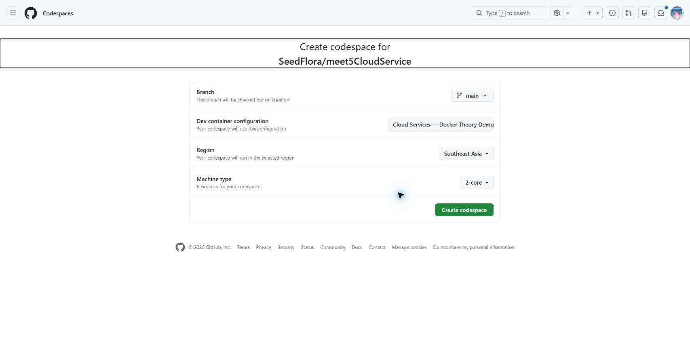

Command / langkah: `Code → Codespaces → New with options → Create codespace`. Ini membuat mesin Linux cloud dari konfigurasi repo. Tidak memasang Docker pada laptop.


```bash
bash scripts/demo-online.sh check
```

**Screenshot 02 — Docker client dan daemon tersedia**

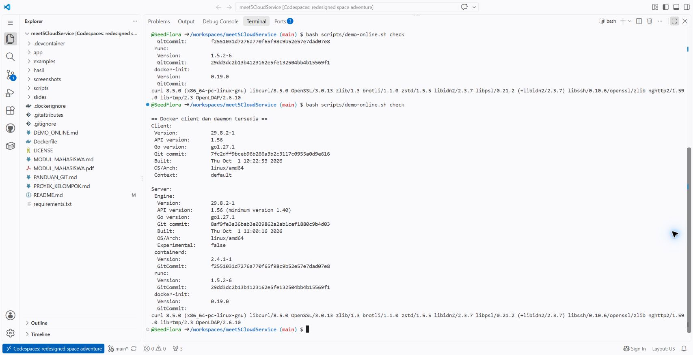

Command / langkah: `bash scripts/demo-online.sh check`. Client mengirim command; Server/daemon membangun image dan menjalankan container. Versi berbeda masih wajar; yang penting keduanya siap.


**Yang harus terlihat:** bagian `Client` dan `Server` pada `docker version`, kemudian versi `curl`. Jika `Client` muncul tetapi `Server` gagal, daemon belum siap; tunggu inisialisasi dan jalankan pemeriksaan lagi.

Konfigurasi `.devcontainer/devcontainer.json` menyiapkan Docker melalui fitur Docker-in-Docker. Aplikasi kelas **tidak otomatis dibuild atau dijalankan** saat workspace dibuka, sehingga dosen dapat memperlihatkan proses build secara bertahap.

**Jangan tertukar dengan `github.dev`:** menekan titik `.` di halaman GitHub membuka editor ringan; editor itu tidak menyediakan mesin compute dan terminal untuk menjalankan Docker. Gunakan **Codespaces**, yang alamat editornya dapat berakhiran `github.dev` tetapi memiliki nama Codespaces dan terminal Linux.

## 3. Lihat resep, lalu build image

Tampilkan resep asli Lab 05:

```bash
cat Dockerfile
```

**Screenshot 03 — Resep aplikasi pada repo**

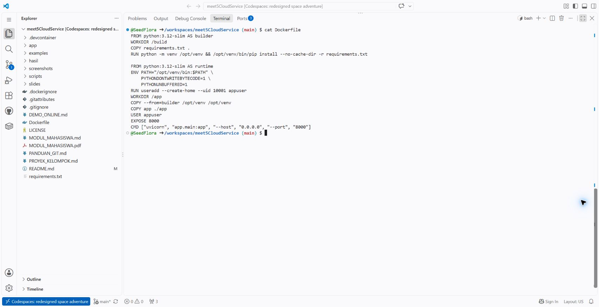

Command / langkah: `cat Dockerfile`. Membaca file tanpa mengubahnya. Cocokkan FROM, RUN, COPY, USER, EXPOSE, dan CMD dengan penjelasan di bawah.


Penjelasan yang ditunjukkan sambil membaca file:

- `FROM ... AS builder`: pilih lingkungan Python untuk tahap persiapan.
- `WORKDIR /build`: tentukan direktori kerja, tanpa mengandalkan `RUN cd` pada instruksi sebelumnya.
- `COPY requirements.txt .`: salin daftar dependensi lebih dahulu agar cache instalasi dapat digunakan ketika kode aplikasi saja berubah.
- `RUN ...`: buat virtual environment dan pasang dependensi saat **build**.
- `FROM ... AS runtime`: mulai tahap image runtime baru.
- `COPY --from=builder ...`: ambil virtual environment hasil builder ke runtime.
- `COPY app ./app`: masukkan kode API.
- `USER appuser`: jalankan aplikasi dengan user bukan root.
- `EXPOSE 8000`: dokumentasikan port aplikasi; instruksi ini **tidak** memublikasikan port.
- `CMD [...]`: perintah default ketika container mulai berjalan. Perintah ini tidak dieksekusi ketika build.

Build image:

```bash
bash scripts/demo-online.sh build
```

**Screenshot 04 — Build image berhasil**

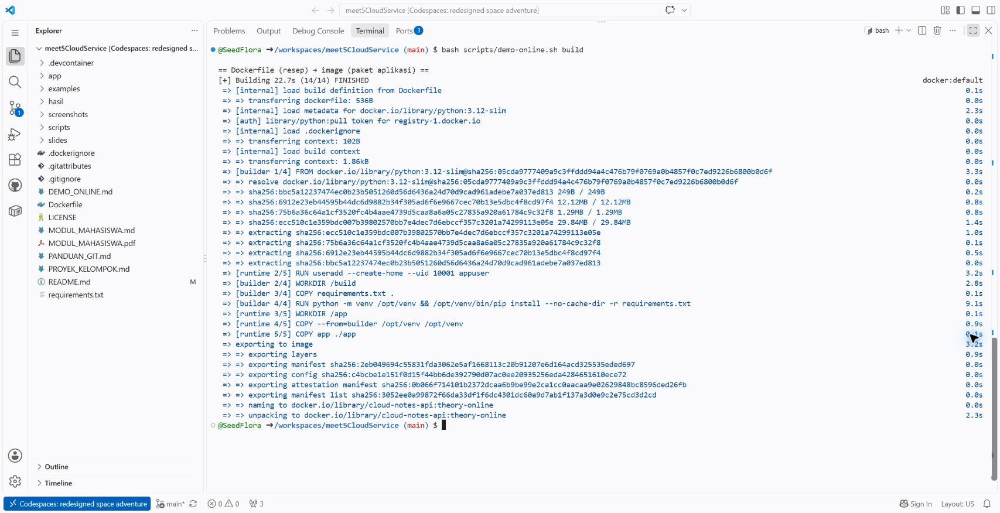

Command / langkah: `bash scripts/demo-online.sh build`. FINISHED dan nama cloud-notes-api:theory-online menunjukkan image dibangun. Build belum menjalankan server.


Script menjalankan padanan berikut:

```bash
docker build --tag cloud-notes-api:theory-online .
```

`--tag` memberi nama image; titik `.` merupakan build context. Pada pengulangan build, sebagian langkah dapat menampilkan **CACHED**. Bandingkan “resep dibaca” dengan “paket sudah tersedia”; build belum membuka web aplikasi.

```bash
docker image ls cloud-notes-api
```

Ukuran image bergantung pada base image, dependensi, platform, dan implementasi; bandingkan angka yang benar-benar muncul pada lingkungan kelas.

## 4. Jalankan container dan lihat status Docker

```bash
bash scripts/demo-online.sh start
```

**Screenshot 05 — Cache build dan container siap**

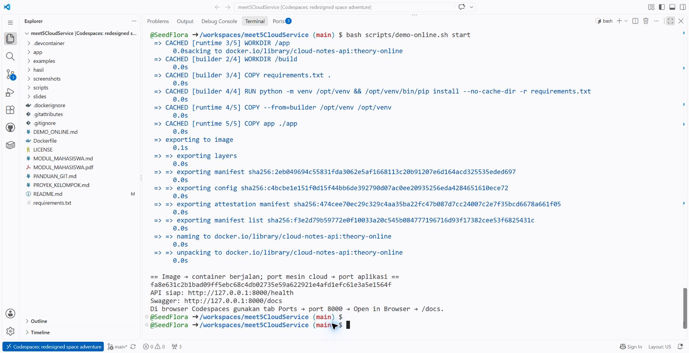

Command / langkah: `bash scripts/demo-online.sh start`. CACHED menunjukkan input build yang dapat digunakan ulang. API siap setelah health merespons; port host dan container sama-sama 8000 pada demo.


Jika container belum ada, script membuild image lalu menjalankan:

```bash
docker run --detach --name cloudlab-theory-online \
  --label edu.binus.cloud-services.demo=week05-online \
  --publish 8000:8000 \
  --env APP_ENV=classroom \
  cloud-notes-api:theory-online
```

| Bagian command | Fungsi |
|---|---|
| `--detach` | Proses tetap berjalan di latar belakang; terminal kembali menerima perintah. |
| `--name` | Nama mudah dibaca untuk log, pemeriksaan, dan cleanup. |
| `--label` | Penanda kepemilikan demo, agar script menolak mengubah container lain yang kebetulan bernama sama. Bukan mekanisme autentikasi. |
| `--publish 8000:8000` | Hubungkan port 8000 mesin cloud dengan port 8000 container. |
| `--env APP_ENV=classroom` | Konfigurasi runtime tanpa mengubah image. Jangan gunakan pola ini untuk menampilkan secret saat presentasi. |
| Nama image | Paket aplikasi yang dipakai untuk membuat container. |

```bash
bash scripts/demo-online.sh status
```

**Screenshot 06 — Status Up, port, UID, dan log**

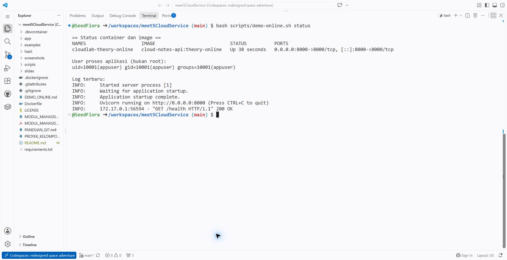

Command / langkah: `bash scripts/demo-online.sh status`. Up menunjukkan proses berjalan. Mapping 8000 menuju port aplikasi; UID 10001 adalah user bukan root. Log Uvicorn menunjukkan server listen 0.0.0.0:8000.


**Yang diamati:** nama container, image, status `Up`, mapping port, user runtime `uid=10001`, dan log Uvicorn. Daemon Docker dan proses aplikasi berjalan di cloud, bukan di laptop penonton.

Script tidak memakai `docker system prune`, tidak menghapus image lain, dan menolak container yang label kepemilikannya tidak sesuai. Memanggil `start` lagi menggunakan ulang container demo yang sudah ada. Setelah kode berubah, jalankan `stop` lalu `start` agar container baru memakai image terbaru.

## 5. Tampilkan web/Swagger di layar kelas

1. Buka tab **Ports** pada panel bawah editor Codespaces.
2. Temukan port **8000** dengan label **Cloud Notes API / Swagger**. Jika belum terlihat, pilih **Add Port / Forward a Port**, masukkan `8000`.
3. Pertahankan **Port Visibility: Private**. Dosen yang login dapat membuka aplikasi; presentasi cukup membagikan layar dosen.
4. Klik ikon globe atau **Open in Browser**. GitHub membuat URL forwarding HTTPS.
5. Tambahkan **`/docs`** pada URL tersebut. Halaman Swagger menampilkan daftar endpoint API.

**Screenshot 07 — Forwarded port 8000 dengan akses Private**

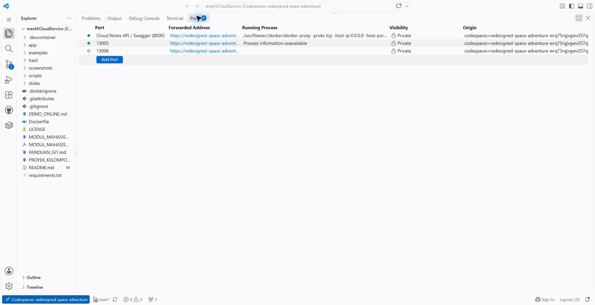

Command / langkah: `Ports → 8000 → Open in Browser → /docs`. Forwarding GitHub menambahkan URL browser ke port host cloud; berbeda dari mapping -p milik Docker.


**Screenshot 08 — GET health lewat browser menghasilkan HTTP 200**

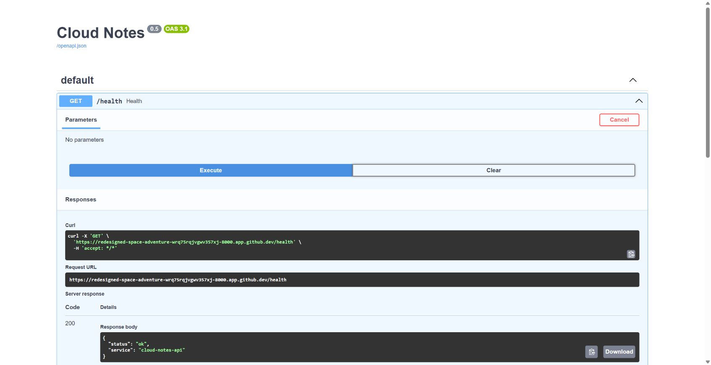

Command / langkah: `GET /health → Try it out → Execute`. Padanan di terminal Codespaces: curl -i http://127.0.0.1:8000/health. status ok menunjukkan liveness API, belum koneksi database.


**Jangan mengetik `http://localhost:8000` pada address bar laptop:** alamat itu menunjuk ke laptop. Gunakan URL pada tab Ports. `localhost` pada terminal Codespaces menunjuk ke mesin cloud, sehingga `curl http://127.0.0.1:8000/health` memang benar di terminal tersebut. Aplikasi di dalam container melayani HTTP; URL HTTPS forwarding disediakan oleh layanan GitHub.

Urutan demonstrasi di Swagger:

1. **GET `/health`** → **Try it out → Execute**. Respons HTTP 200 menunjukkan aplikasi melayani permintaan.
2. **GET `/runtime`** → Execute. Respons menunjukkan `environment: classroom` dan `storage: memory`; kaitkan dengan `--env` pada `docker run`.
3. **POST `/notes`** → Try it out, masukkan contoh di bawah, lalu Execute. Respons HTTP 201 membuat catatan dan menghasilkan `id`.

```json
{
  "title": "Demo Docker teori",
  "content": "Aplikasi yang sama berjalan pada mesin cloud."
}
```

4. **GET `/notes`** → Execute. Catatan yang baru dibuat muncul dalam daftar.
5. **POST `/notes`** dengan `title` berisi spasi saja → HTTP 422. API memvalidasi input; container hidup bukan berarti semua request pasti valid.
6. **GET `/notes/{note_id}`** dengan `note_id` **0** → HTTP 404. ID 0 tidak dibuat oleh aplikasi ini.

**Screenshot 09 — POST catatan berhasil dengan HTTP 201**

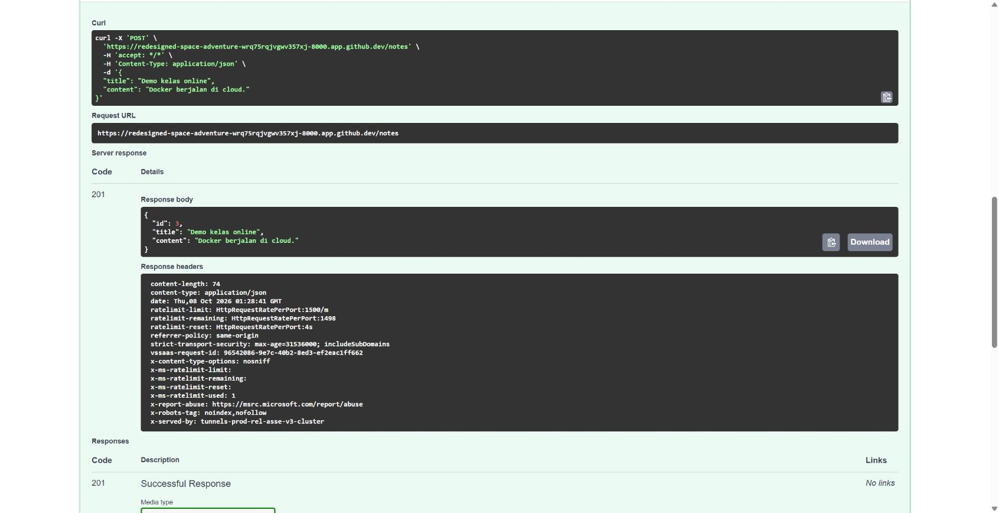

Command / langkah: `POST /notes → Try it out → isi JSON → Execute`. Payload screenshot adalah title Demo kelas online dan content Docker berjalan di cloud. Curl di screenshot memperlihatkan method, Content-Type, dan body. ID 3 adalah hasil uji ini; pada sesi baru ID dapat berbeda.


**Screenshot 10 — GET daftar membaca catatan yang dibuat**

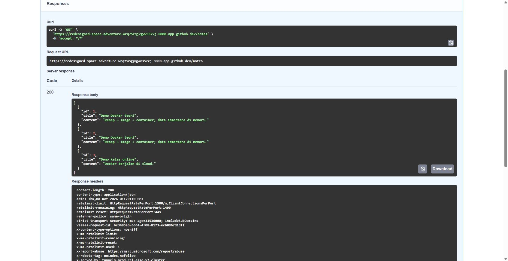

Command / langkah: `GET /notes → Try it out → Execute`. Padanan terminal: curl -i http://127.0.0.1:8000/notes. Daftar memuat catatan dari script test dan POST browser. HTTP 200 tidak membuktikan data persisten.


Screenshot utama yang berguna untuk catatan kelas: terminal build, status container + port, tab Ports, Swagger `/health`, hasil POST 201, daftar catatan, dan daftar kosong setelah restart. Tampilkan command yang menghasilkan setiap screenshot dan jelaskan outputnya.

## 6. Pemeriksaan end to end dan data sementara

Untuk memperlihatkan pemeriksaan otomatis yang menguji aplikasi sungguhan:

```bash
bash scripts/demo-online.sh test
```

**Screenshot 11 — Pemeriksaan end to end lulus**

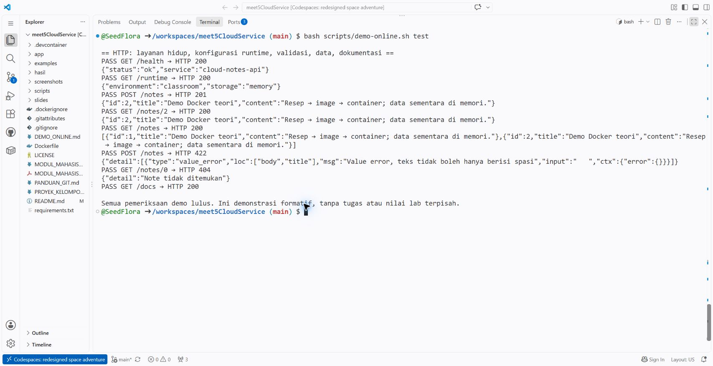

Command / langkah: `bash scripts/demo-online.sh test`. 200 untuk baca/health/docs; 201 untuk create; 422 untuk judul kosong; 404 untuk ID 0. PASS mengikuti respons layanan sungguhan.


Script memeriksa respons `/health`, nilai `APP_ENV`, membuat catatan, membaca catatan tersebut, memeriksa daftar, menolak input kosong dengan HTTP 422, memeriksa HTTP 404, dan membuka `/docs`. **PASS** diberikan setelah HTTP status dan isi penting sesuai; halaman Swagger sendiri tidak dicetak seluruhnya ke terminal.

Demonstrasi sifat in-memory:

```bash
bash scripts/demo-online.sh test --restart
```

**Screenshot 12 — Restart mengosongkan data memori**

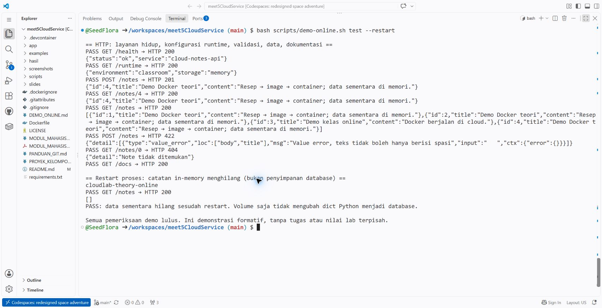

Command / langkah: `bash scripts/demo-online.sh test --restart`. Setelah docker restart, GET /notes menghasilkan []. Image masih ada. Memori proses tidak menjadi persisten hanya karena diberi volume.


Command ini membuat catatan uji, me-restart **container demo**, lalu memastikan GET `/notes` menghasilkan `[]`. Data hilang karena dict Python disimpan dalam memori proses. Restart proses saja sudah menghapusnya; menambahkan volume tidak otomatis membuat dict menjadi database. Database dan persistensi akan dikembangkan pada tahapan proyek berikutnya.

Ini pertanyaan diskusi formatif, beserta jawabannya: “Apakah image terhapus saat container restart?” **Tidak.** Image masih ada. Yang hilang pada contoh ini adalah data di memori proses aplikasi.

## 7. Berhenti setelah kelas

Hapus container demo sendiri:

```bash
bash scripts/demo-online.sh stop
```

**Screenshot 13 — Container demo dibersihkan**

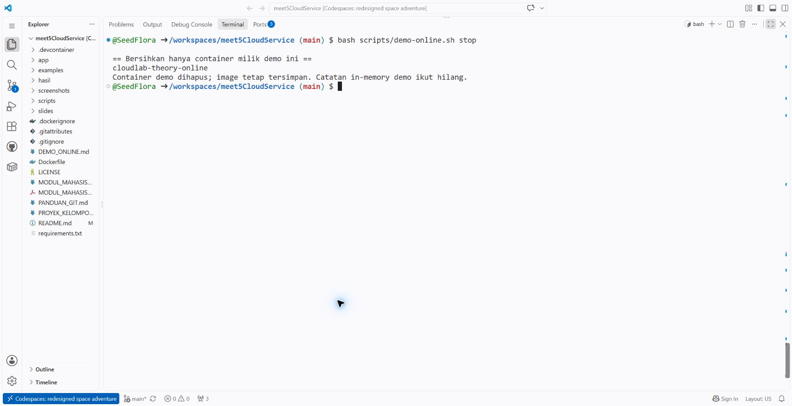

Command / langkah: `bash scripts/demo-online.sh stop`. Menghapus hanya container bernama dan berlabel milik demo. Image tetap tersedia; container lain tidak dibersihkan.


Image tetap tersedia sehingga build berikutnya dapat memakai cache. Semua catatan demo sementara hilang. Script tidak mengubah container lain.

Selanjutnya hentikan **Codespaces**, bukan hanya menutup tab: buka [github.com/codespaces](https://github.com/codespaces), pilih menu **…** di Codespace kelas → **Stop codespace**. Menghentikan Codespace menghentikan penggunaan compute; penyimpanan tetap dihitung selama Codespace masih ada.

**Screenshot 14 — Codespace sudah Stopped**

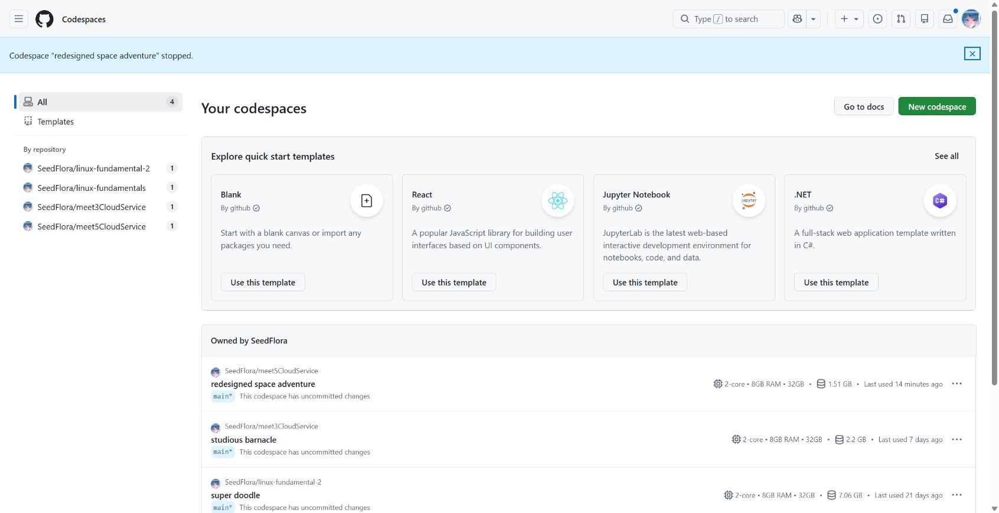

Command / langkah: `github.com/codespaces → menu … → Stop codespace`. Stopped menghentikan compute. Lingkungan disimpan untuk dibuka kembali, sehingga storage masih dihitung. Menutup tab saja bukan langkah penghentian.


Pada **8 Oktober 2026**, akun personal GitHub Free mendapat **120 core-hours compute** dan **15 GB-month storage** per bulan. Mesin 2 core mengonsumsi 2 core-hours untuk satu jam aktif, sehingga 120 core-hours setara sekitar 60 jam aktif pada mesin itu. Kuota bersama penggunaan Codespaces lain pada akun; bukan jaminan gratis tanpa batas. Detail dan kebijakan terbaru: [GitHub Codespaces billing](https://docs.github.com/en/billing/concepts/product-billing/github-codespaces).

Jika Codespace akan **dihapus**, commit dan push perubahan yang ingin disimpan terlebih dahulu. Penghapusan membuang perubahan yang belum tersimpan di remote. Untuk demo tanpa perubahan kode, cukup Stop setelah kelas; hapus lingkungan jika sudah tidak diperlukan.

## 8. Jalur cadangan: Killercoda Docker Playground

Gunakan [Killercoda Docker Playground](https://killercoda.com/playgrounds/scenario/docker) jika Codespaces tidak tersedia. Login sesuai permintaan layanan, tunggu terminal siap, lalu jalankan:

```bash
git clone https://github.com/SeedFlora/meet5CloudService.git
```

```bash
cd meet5CloudService
```

```bash
bash scripts/demo-online.sh check
```

```bash
bash scripts/demo-online.sh start
```

```bash
bash scripts/demo-online.sh test
```

Untuk web, buka panel **Traffic / Port Access** pada antarmuka playground, masukkan port **8000**, lalu tambahkan `/docs` pada URL yang diberikan. Nama menu dapat berbeda menurut antarmuka layanan. Untuk demonstrasi terminal saja, `curl` dan script tetap dapat ditampilkan tanpa membuka akses web. URL akses Killercoda bukan port private berautentikasi seperti Codespaces; gunakan hanya data dummy demo.

Sesi gratis Killercoda dibatasi sekitar **1 jam per lingkungan** dan bersifat sementara; setelah sesi berakhir lingkungan dihapus. Jangan menaruh data kelas penting atau secret produksi di dalamnya. Simpan perubahan ke repo milik sendiri sebelum lingkungan hilang. Rincian: [FAQ resmi Killercoda](https://killercoda.com/faq).

**Play with Docker tidak digunakan:** [pengumuman pada repo resminya](https://github.com/play-with-docker/play-with-docker) menyatakan layanan tidak tersedia mulai 1 Maret 2026. Gunakan Codespaces atau playground yang masih tersedia.

## 9. Kendala umum

| Gejala | Langkah |
|---|---|
| Tidak ada terminal Linux / Docker di editor GitHub | Pastikan membuka **Codespaces**, bukan editor ringan `github.dev`. |
| Docker daemon belum siap | Tunggu proses konfigurasi, jalankan `docker version` dan `check` lagi. Jika konfigurasi repo baru ditambahkan pada Codespace lama, **Codespaces: Rebuild Container**; simpan perubahan dulu. |
| Kuota habis / pembuatan Codespace ditolak | Periksa kuota akun dan gunakan Killercoda sebagai cadangan. |
| Port 8000 sudah dipakai | Jalankan `DEMO_PORT=18005 bash scripts/demo-online.sh start`; gunakan awalan yang sama untuk `test` dan `status`. Forward port 18005 secara manual pada tab Ports. |
| Script menolak nama container | Ada container lain dengan nama demo tetapi label berbeda. Jangan menghapusnya tanpa memeriksa pemiliknya. Gunakan Codespace baru untuk kelas. |
| Browser menampilkan 404 di `/` | Aplikasi ini tidak membuat homepage. Buka **`/docs`**, `/health`, atau `/runtime`. |
| Gagal mengakses `localhost` dari browser laptop | Buka URL HTTPS pada tab **Ports**. |
| Kode diubah tetapi respons lama | `stop`, lalu `start`; container lama tidak otomatis diganti ketika image dibuild ulang. |
| Catatan hilang sesudah restart | Perilaku yang diharapkan: penyimpanan masih di memori proses. |

## 10. Sumber resmi

- [GitHub Codespaces quickstart](https://docs.github.com/en/codespaces/quickstart): pembuatan lingkungan melalui browser.
- [Port forwarding di Codespaces](https://docs.github.com/en/codespaces/developing-in-a-codespace/forwarding-ports-in-your-codespace): port dan visibility.
- [Docker-in-Docker Feature](https://github.com/devcontainers/features/tree/main/src/docker-in-docker): Docker pada dev container.
- [Referensi Dockerfile](https://docs.docker.com/reference/dockerfile/): instruksi dan perilakunya.
- [Multi-stage builds](https://docs.docker.com/build/building/multi-stage/): pemisahan builder dan runtime.
- [Build secrets](https://docs.docker.com/build/building/secrets/): gunakan secret mounts untuk kebutuhan build, bukan ARG/ENV untuk secret.
- [Codespaces billing](https://docs.github.com/en/billing/concepts/product-billing/github-codespaces) dan [Killercoda FAQ](https://killercoda.com/faq): batas penggunaan.
