# Modul mahasiswa Lab 05 — Dockerfile dan Cloud Notes API

**Kebijakan kelas:** Lab ini latihan formatif, tanpa tugas, nilai, atau penyerahan terpisah. Satu proyek besar dikerjakan oleh kelompok **3 orang**, dengan presentasi checkpoint minggu 7 (UTS) dan hasil akhir minggu 14 (UAS). Simpan hasil lab hanya bila berguna sebagai referensi atau bukti proses proyek. Baca [brief proyek kelompok](PROYEK_KELOMPOK.md). Bobot resmi tetap mengikuti RPS/LMS.

**Sesi RPS:** 05 · **Jalur utama:** build dan run lokal · **Lanjutkan ke:** repo Lab 06 setelah praktik ini

## Hasil belajar

Anda dapat menjelaskan tiap tahap [`Dockerfile`](Dockerfile), membangun image bertag, menguji REST API dalam container, menunjukkan proses berjalan sebagai user non-root, dan menjelaskan mengapa catatan hilang setelah container diganti. Kode FastAPI ada di [`app/main.py`](app/main.py); dependensi ada di [`requirements.txt`](requirements.txt).

**Teori singkat.** Dockerfile adalah resep build image. Tahap `builder` memasang dependensi Python ke virtual environment; tahap `runtime` menyalin hanya hasil yang diperlukan serta kode aplikasi. [`.dockerignore`](.dockerignore) mengurangi berkas yang masuk ke build context. `RUN` dieksekusi saat build; `CMD` memberi perintah default saat container mulai, sedangkan `ENTRYPOINT` dapat menetapkan executable utama. `ENV` pada Dockerfile berbeda dari `-e` pada `docker run`: `-e` memasok nilai saat container dijalankan. Data API ini disimpan di memori proses, belum di volume/database.

**Pilihan demo kelas:** [panduan online](DEMO_ONLINE.md) menjalankan API utama hanya dengan browser; [panduan Compose](COMPOSE_DEMO.md) menambahkan frontend dan PostgreSQL sebagai contoh terpisah. Keduanya latihan formatif. API utama memakai port host 8000 dan memori; default Compose memakai API 13005, frontend 13006, serta database internal `db:5432`. Screenshot Compose online memakai alternatif API **13105** dan frontend **13106** untuk menghindari proses lain pada host 13005; panduan menunjukkan perubahan `.env` dan pemilihan port yang benar. Port di dalam container tetap API 8000/web 80. Jangan menukar URL atau menganggap hasil memori pada contoh pertama sudah persisten.

## Mulai dari komputer kampus Windows

Bagian ini dimulai dari PC yang belum mempunyai folder Lab 05. Gunakan **PowerShell biasa** pada akun Windows Anda, dengan folder kerja yang dapat ditulis. Clone publik cukup untuk mencoba materi; latihan ini tidak mewajibkan repo pribadi atau push.

### 1. Periksa Git dan Docker Desktop

Buka **Docker Desktop** dari Start dan tunggu Engine siap. Lab memakai **Linux containers** untuk image Python/Nginx/PostgreSQL. Di PowerShell:

```powershell
git --version
docker version
docker info --format '{{.OSType}}'
```

**Fungsi/cara membaca:** Git menampilkan versinya; `docker version` harus menampilkan **Client dan Server**; command terakhir menghasilkan **linux**. Client saja belum membuktikan Engine berjalan. Python tidak perlu dipasang pada PC karena runtime/dependency API dipasang dalam image.

PC kampus sebaiknya sudah disiapkan pengelola dengan Git, Docker Desktop, backend Linux, dan akses yang diperlukan. Jika command tidak dikenali, Engine tidak dapat dimulai, atau instalasi/virtualisasi dibatasi kebijakan kampus, minta bantuan pengelola lab dan gunakan [jalur Codespaces di browser](DEMO_ONLINE.md) untuk kelas. Ikuti kebijakan kampus untuk instalasi atau perubahan sistem. [Docker Desktop Windows](https://docs.docker.com/desktop/setup/install/windows-install/)

### 2. Buat folder kerja dan clone materi

Pada GitHub, buka repo pengajar lalu **Code → Local → HTTPS**. Jika folder `meet5CloudService` sudah ada pada PC, gunakan bagian **repo sudah ada** di bawah. Untuk clone pertama:

```powershell
$campusFolder = Join-Path ([Environment]::GetFolderPath('MyDocuments')) 'CloudServices'
New-Item -ItemType Directory -Path $campusFolder -Force | Out-Null
Set-Location -LiteralPath $campusFolder
git clone https://github.com/SeedFlora/meet5CloudService.git
Set-Location -LiteralPath 'meet5CloudService'
Get-Location
Get-ChildItem -LiteralPath 'Dockerfile', 'requirements.txt', 'app/main.py'
git remote -v
```

**Fungsi/cara kerja:** `GetFolderPath` mengambil lokasi Documents milik akun, termasuk bila dialihkan oleh kebijakan PC; `New-Item` menyiapkan subfolder tanpa menghapus isinya. `Set-Location` memindahkan terminal. `git clone` mengunduh kode/riwayat Git dan membuat folder `meet5CloudService` dengan remote `origin`. `Get-ChildItem` memastikan Dockerfile, dependency, dan kode API tersedia. **Checkpoint:** lokasi berakhir pada `CloudServices\meet5CloudService`, tiga berkas ditemukan, origin menuju SeedFlora/meet5CloudService. Folder itu **root repo** untuk build berikut. Jika Documents tidak dapat ditulis pada PC tertentu, gunakan folder pribadi yang diizinkan pengelola atau jalur online.

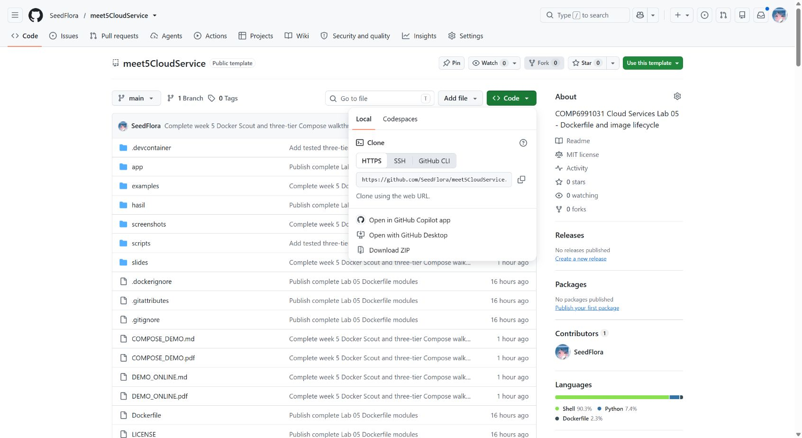

**Command / langkah:** `Code > Local > HTTPS` dan `git clone https://github.com/SeedFlora/meet5CloudService.git`. **Fungsi/cara kerja:** menu GitHub menampilkan URL sumber; git clone menyalin kode/riwayat menjadi repo lokal dengan metadata .git dan origin. **Baca:** screenshot aktual menunjukkan menu HTTPS pada repo publik pengajar; URL lengkap dicantumkan pada command agar dapat disalin. Ini screenshot GitHub, bukan bukti PowerShell di PC kampus; jalankan blok PowerShell di atas dan periksa lokasi serta tiga file pada PC Anda.

Repo hasil clone sudah mempunyai metadata Git, sehingga **tidak perlu `git init`**. Remote publik ini milik pengajar; **jangan push ke repo pengajar**. Perubahan percobaan boleh tetap lokal. Jika ingin menyimpan kontribusi proyek kelompok, ikuti [panduan repo pribadi/kelompok](PANDUAN_GIT.md) dan periksa origin milik Anda sebelum push. [Cara kerja clone](https://git-scm.com/docs/git-clone)

### 3. Jika repo sudah ada di PC

Masuk folder yang sama, periksa remote dan perubahan dahulu:

```powershell
$campusFolder = Join-Path ([Environment]::GetFolderPath('MyDocuments')) 'CloudServices'
Set-Location -LiteralPath (Join-Path $campusFolder 'meet5CloudService')
git remote -v
git status --short
```

**Hanya jika `git status --short` kosong**, perbarui dengan:

```powershell
git pull --ff-only
```

`--ff-only` menerima pembaruan fast-forward; bila history berbeda, command berhenti untuk diperiksa. Jika status menampilkan perubahan, simpan dan tinjau pekerjaan Anda dahulu atau gunakan folder baru; jangan overwrite, `reset --hard`, atau membersihkan file untuk memaksa update. Pada PC bersama, pastikan folder/repo milik sesi Anda.

### 4. Lokal membutuhkan internet pada persiapan pertama

Clone mengunduh kode dari GitHub; build awal menarik base image dan mengunduh dependency. Jadi **jalur lokal bukan sepenuhnya offline**. Setelah image tersedia, API utama dapat dicoba melalui localhost tanpa internet; rebuild/pull dependency baru serta Docker Scout tetap memerlukan koneksi sesuai kebutuhannya. Lanjutkan bagian **Persiapan dan build** dari root repo yang baru dibuka.

Rujukan persiapan: [clone repo melalui HTTPS di GitHub](https://docs.github.com/en/repositories/creating-and-managing-repositories/cloning-a-repository) dan [instalasi Docker Compose](https://docs.docker.com/compose/install/). Gunakan konfigurasi PC yang disiapkan kampus; jalur Compose lengkap ada di [panduan tiga layanan](COMPOSE_DEMO.md).

## Persiapan dan build

Pastikan Docker Engine berjalan, port host **8000** kosong, dan terminal berada di root repo Lab 05. Di PowerShell, Bash, atau WSL:

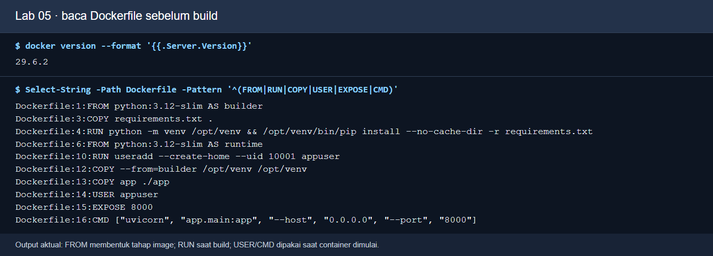

*Perintah: `docker version --format '{{.Server.Version}}'` dan PowerShell `Select-String -Path Dockerfile -Pattern '^(FROM|RUN|COPY|USER|EXPOSE|CMD)'`. Fungsi: memastikan Engine aktif dan membaca tahap build/runtime sebelum build. Cara kerja: pencarian memilih instruksi Dockerfile; `FROM` membuat tahap, `RUN` memasang dependensi, `USER` memilih proses non-root, `CMD` menjalankan API. Baca hasil: dua `FROM`, `USER appuser`, dan port 8000. Ini render output command aktual.*

```bash
docker version
docker build -t cloud-notes-api:lab05 .
docker image ls cloud-notes-api
docker run --name cloudlab-api -d -p 127.0.0.1:8000:8000 -e APP_ENV=classroom cloud-notes-api:lab05
docker ps --filter name=cloudlab-api
docker logs cloudlab-api
docker exec cloudlab-api id
docker image inspect cloud-notes-api:lab05 --format '{{.Size}} bytes; user={{.Config.User}}'
```

**Checkpoint A:** image `cloud-notes-api:lab05` terdaftar; log menunjukkan Uvicorn menerima koneksi pada port 8000. Tunggu beberapa detik bila API belum siap segera setelah `docker run`. Buka `http://127.0.0.1:8000/docs`. Dokumentasi OpenAPI yang Anda lihat akan mirip screenshot hasil run lokal berikut.

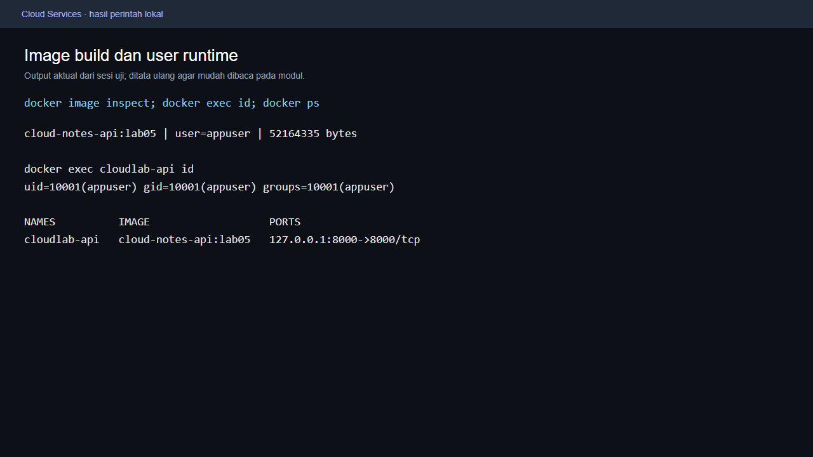

* **Langkah:** Jalankan `docker build -t cloud-notes-api:lab05 .`, `docker exec cloudlab-api id`, dan `docker image inspect`. **Fungsi:** Membuktikan build API, user runtime non-root, serta port yang dipakai. **Cara kerja:** Dockerfile multi-stage membuat image; proses API berjalan sebagai appuser di dalam container. **Baca hasil:** Baca tag image, UID 10001/appuser, dan mapping host 8000 ke container 8000; ukuran image dapat berbeda.

*Gambar: hasil aktual `docker image inspect`, `docker exec id`, dan `docker ps`. Pada mesin Anda, periksa `appuser`, UID 10001, dan port host 8000; ukuran image dapat berbeda.*

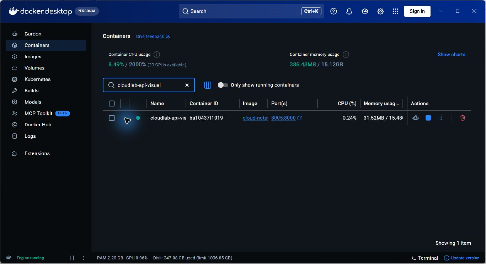

* **Langkah:** Buka Docker Desktop > Containers setelah `docker run`, lalu bandingkan dengan `docker ps`. **Fungsi:** Melihat status container dan pemetaan port tanpa kehilangan arti perintah CLI. **Cara kerja:** Docker menjalankan image `cloud-notes-api:lab05` sebagai container; titik hijau menandai proses sedang berjalan. **Baca hasil:** Pada screenshot uji, host **8005** diteruskan ke port container **8000** (`docker run --name cloudlab-api-visual -d -p 127.0.0.1:8005:8000 ...`) karena Lab 06 memakai host 8000 pada waktu yang sama. Langkah utama Anda tetap memakai `127.0.0.1:8000:8000` dan URL port 8000; status HTTP 200 diuji terpisah agar titik hijau tidak disalahartikan sebagai healthcheck.*

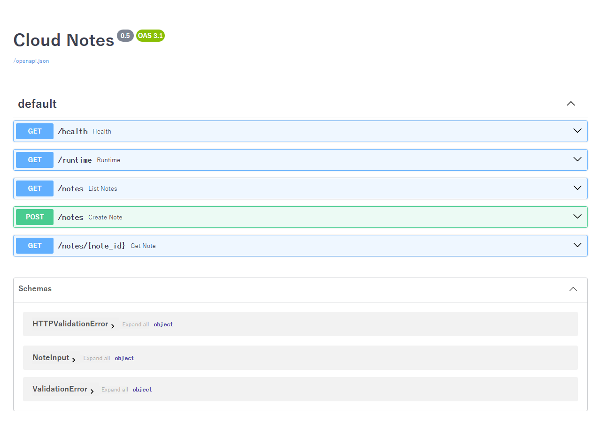

* **Langkah:** Setelah `docker run -p 127.0.0.1:8000:8000`, buka `http://127.0.0.1:8000/docs`. **Fungsi:** Mengenali kontrak endpoint API Cloud Notes. **Cara kerja:** FastAPI membangun Swagger UI dari skema OpenAPI aplikasi yang hidup di container. **Baca hasil:** Cari route `/health`, `/runtime`, dan `/notes`; buka satu route untuk melihat metode serta bentuk respons.

## Praktik API dan validasi

Di PowerShell:

```powershell
Invoke-RestMethod http://127.0.0.1:8000/health
Invoke-RestMethod http://127.0.0.1:8000/runtime
Invoke-RestMethod http://127.0.0.1:8000/notes -Method Post -ContentType application/json -Body '{"title":"Docker","content":"Catatan kelas"}'
Invoke-RestMethod http://127.0.0.1:8000/notes
try { Invoke-WebRequest http://127.0.0.1:8000/notes -Method Post -ContentType application/json -Body '{"title":"","content":"uji"}' -UseBasicParsing } catch { [int]$_.Exception.Response.StatusCode }
```

Di Bash/WSL:

```bash
curl -fsS http://127.0.0.1:8000/health
curl -fsS http://127.0.0.1:8000/runtime
curl -fsS -X POST http://127.0.0.1:8000/notes -H 'Content-Type: application/json' -d '{"title":"Docker","content":"Catatan kelas"}'
curl -fsS http://127.0.0.1:8000/notes
curl -s -o /dev/null -w '%{http_code}\n' -X POST http://127.0.0.1:8000/notes -H 'Content-Type: application/json' -d '{"title":"","content":"uji"}'
```

**Checkpoint B:** `/health` bernilai `ok`, `/runtime` menampilkan `APP_ENV=classroom` dan `storage=memory`, POST membuat catatan, GET menampilkannya, dan judul kosong menghasilkan HTTP **422**. ID dan urutan catatan bisa berbeda. Screenshot berikut adalah contoh respons dari container lokal; buat bukti sendiri saat praktik.

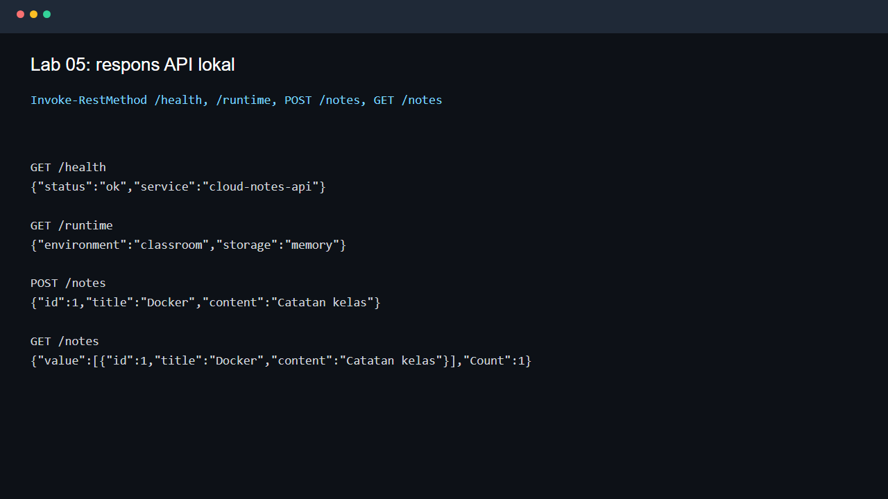

* **Langkah:** Kirim GET `/health`, GET `/runtime`, POST `/notes`, dan GET `/notes` dengan `curl` atau `Invoke-RestMethod`. **Fungsi:** Menguji kesehatan, identitas runtime, dan alur tulis/baca catatan. **Cara kerja:** Request host masuk melalui port publish ke FastAPI; POST menyimpan catatan dalam memori proses. **Baca hasil:** Baca `status` sehat, `appuser`, respons catatan baru, lalu item yang sama pada daftar GET.

Hapus container, jalankan image yang sama lagi, lalu GET daftar catatan. Gunakan perintah sesuai terminal:

```bash
docker rm -f cloudlab-api
docker run --name cloudlab-api -d -p 127.0.0.1:8000:8000 -e APP_ENV=classroom cloud-notes-api:lab05
```

PowerShell: `Invoke-RestMethod http://127.0.0.1:8000/notes`; Bash: `curl -fsS http://127.0.0.1:8000/notes`. **Checkpoint C:** daftar dimulai kosong setelah proses/container baru siap. Jelaskan penyebabnya dan bandingkan dengan Lab 06 nanti.

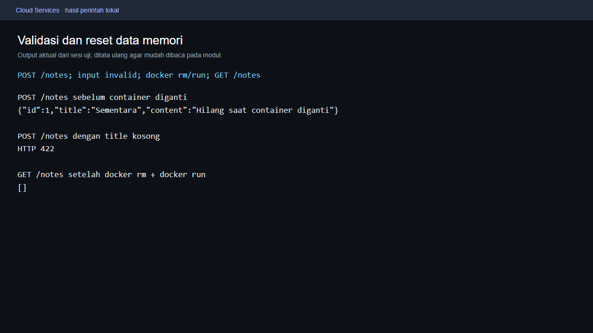

* **Langkah:** POST judul kosong ke `/notes`, lalu `docker rm -f cloudlab-api` dan jalankan container baru dari image sama. **Fungsi:** Mendemonstrasikan validasi input dan batas penyimpanan in-memory. **Cara kerja:** FastAPI menolak payload tidak valid; container baru memulai proses dengan memori kosong. **Baca hasil:** Cari HTTP 422 dan daftar catatan kosong setelah restart lewat container baru.

*Gambar: output aktual dari POST valid, POST berjudul kosong, dan GET setelah `docker rm`/`docker run`. ID serta isi catatan Anda boleh berbeda.*

**Tantangan kode mandiri:** tambahkan endpoint `GET /stats` pada salinan Anda di `app/main.py`. Kembalikan `note_count` dan `longest_title_chars`; saat belum ada catatan keduanya bernilai 0. Gunakan lock yang sama dengan operasi catatan, uji sebelum dan sesudah membuat dua catatan, lalu build ulang image dengan tag berbeda. Tantangan ini latihan tambahan; endpoint inti di atas harus berhasil lebih dahulu.

## Diskusi, catatan opsional, dan Git

Diskusikan bersama dosen: (1) bagian mana dari Dockerfile berjalan saat build dan bagian mana saat run; apa beda `CMD` dan `ENTRYPOINT` dalam konteks ini; (2) mengapa `.dockerignore` memuat `.env`; (3) apa arti port kiri/kanan pada `127.0.0.1:8000:8000`; (4) apa hubungan validasi `Field(min_length=1)` dengan HTTP 422; (5) apa kelemahan menyimpan catatan hanya di memori.

Pertanyaan tersebut dipakai untuk diskusi kelas, bukan penyerahan atau penilaian terpisah; kuncinya tersedia pada bagian akhir. Catatan dan Git di bawah bersifat opsional sebagai referensi proses proyek kelompok.

Jika ingin menyimpan catatan proses proyek, dari root repo salin [template laporan](hasil/TEMPLATE_LAPORAN.md) menjadi `hasil/lab05.md`: PowerShell `Copy-Item hasil/TEMPLATE_LAPORAN.md hasil/lab05.md`; Bash `cp hasil/TEMPLATE_LAPORAN.md hasil/lab05.md`. Catat hasil nyata, perintah, jawaban, dan screenshot Anda di `hasil/bukti/`. Catatan ini opsional; jangan memakai screenshot modul sebagai bukti pribadi.

```bash
docker rm -f cloudlab-api
```

Dari root repo Lab 05, ikuti [panduan Git](PANDUAN_GIT.md) untuk repo sendiri:

```bash
git status --short
git add Dockerfile .dockerignore requirements.txt app MODUL_MAHASISWA.md hasil/lab05.md hasil/bukti
git diff --cached --name-only
git diff --cached --check
git commit -m "lab05: build dan uji Cloud Notes API"
git push
```

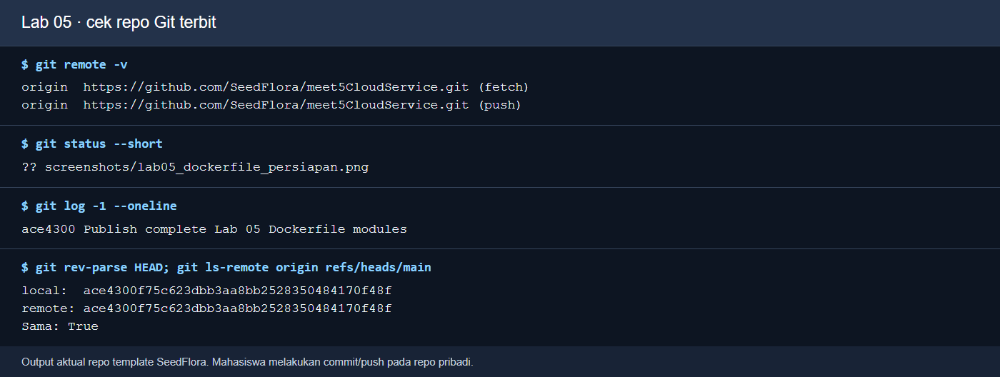

*SHA pada gambar adalah snapshot saat uji. Setelah modul diperbarui, jalankan ulang perintah untuk memeriksa commit terbaru.*

*Perintah: `git remote -v`, `git status --short`, `git log -1 --oneline`, `git rev-parse HEAD`, dan `git ls-remote origin refs/heads/main`. Fungsi: memeriksa tujuan serta hasil push kode. Cara kerja: Git membandingkan SHA commit lokal dengan SHA `main` remote. Baca hasil: `Sama: True` untuk repo pengajar; mahasiswa mengulanginya pada repo pribadi. Ini render output command aktual.*

Jika belum ada folder bukti, hilangkan argumen itu dari `git add`. Pastikan staged tidak berisi `.env`, kredensial, atau hasil build. Jika push pertama belum punya upstream, jalankan `git push -u origin main`.

**Jika gagal:** konflik port 8000 biasanya berarti container Lab 06 atau Lab 05 lama masih aktif (`docker ps`). Jika `docker build` gagal mengambil image/dependensi, cek koneksi internet dan jalankan ulang. Jika aplikasi belum siap setelah `run`, tunggu status log Uvicorn sebelum memanggil API.

**Pilihan cloud — Docker Hub:** bila dosen meminta publish image dan Anda punya akun, jalankan `docker tag cloud-notes-api:lab05 NAMA_AKUN/cloud-notes-api:lab05`, `docker login`, lalu `docker push NAMA_AKUN/cloud-notes-api:lab05`. Ganti `NAMA_AKUN`; jangan merekam token login atau memasukkannya ke repo. Push Git untuk kode tetap terpisah dari push image ke registry.

## Kunci tantangan dan kasus kerja harian

**Kasus:** tim support perlu melihat jumlah tiket/catatan serta judul terpanjang tanpa membuka semua isi catatan. Anda menambahkan endpoint statistik baca saja. Kunci ada di bawah; lakukan percobaan sendiri dahulu, lalu bandingkan hasil. Semua perintah dijalankan dari **root repo Lab 05**.

### 1. Baca kontrak aplikasi

`Dockerfile` tahap `builder` memasang paket ke `/opt/venv`; tahap `runtime` menyalin hasilnya, memasang kode, dan menjalankan Uvicorn sebagai UID 10001. `docker build` menjalankan instruksi build dan menghasilkan image. `docker run` membuat proses container dari image tersebut. Port kiri `127.0.0.1:8000` adalah port laptop yang hanya menerima koneksi lokal; port kanan `8000` milik proses dalam container.

### 2. Kunci kode `GET /stats`

Tambahkan potongan berikut ke akhir `app/main.py`, di luar fungsi lain. Variabel `_notes` dan `_lock` sudah disediakan oleh starter; jangan membuat dictionary atau lock baru karena hasilnya akan terpisah dari endpoint `/notes`.

```python
@app.get("/stats")
def stats() -> dict[str, int]:
    with _lock:
        titles = [item["title"] for item in _notes.values()]
        return {
            "note_count": len(titles),
            "longest_title_chars": max((len(title) for title in titles), default=0),
        }
```

Lock memastikan snapshot daftar judul konsisten bila ada request POST bersamaan. `default=0` membuat hasil awal tetap valid ketika belum ada catatan. Hitung panjang judul yang sudah divalidasi dan dipangkas spasinya oleh `NoteInput`.

### 3. Build ulang dan uji dari awal sampai akhir

Gunakan tag baru supaya jelas image mana yang berisi solusi. Hapus container percobaan Lab 05 yang lama bila masih ada, lalu:

```bash
docker build -t cloud-notes-api:stats .
docker rm -f cloudlab-api
docker run --name cloudlab-api -d -p 127.0.0.1:8000:8000 -e APP_ENV=classroom cloud-notes-api:stats
```

Jika `docker rm` melaporkan container tidak ada, lanjutkan ke `docker run`. Tunggu `/health` menjawab HTTP 200. Di **PowerShell**, jalankan:

```powershell
Invoke-RestMethod http://127.0.0.1:8000/stats
Invoke-RestMethod http://127.0.0.1:8000/notes -Method Post -ContentType application/json -Body '{"title":"Ops","content":"Pertama"}'
Invoke-RestMethod http://127.0.0.1:8000/notes -Method Post -ContentType application/json -Body '{"title":"Incident 42","content":"Kedua"}'
Invoke-RestMethod http://127.0.0.1:8000/stats
try { Invoke-WebRequest http://127.0.0.1:8000/notes -Method Post -ContentType application/json -Body '{"title":"   ","content":"uji"}' -UseBasicParsing } catch { [int]$_.Exception.Response.StatusCode }
```

Di **Bash/Git Bash**, padanannya:

```bash
curl -fsS http://127.0.0.1:8000/stats
curl -fsS -X POST http://127.0.0.1:8000/notes -H 'Content-Type: application/json' -d '{"title":"Ops","content":"Pertama"}'
curl -fsS -X POST http://127.0.0.1:8000/notes -H 'Content-Type: application/json' -d '{"title":"Incident 42","content":"Kedua"}'
curl -fsS http://127.0.0.1:8000/stats
curl -s -o /dev/null -w '%{http_code}\n' -X POST http://127.0.0.1:8000/notes -H 'Content-Type: application/json' -d '{"title":"   ","content":"uji"}'
```

**Hasil kunci:** awal `{"note_count":0,"longest_title_chars":0}`; sesudah dua POST `{"note_count":2,"longest_title_chars":11}`; judul spasi saja ditolak HTTP **422**. Jika hasil `/stats` masih 404, image baru belum dibuild atau container masih memakai tag lama. Cek dengan `docker ps --filter name=cloudlab-api --format '{{.Image}}'`. Setelah merekam bukti, jalankan `docker rm -f cloudlab-api`.

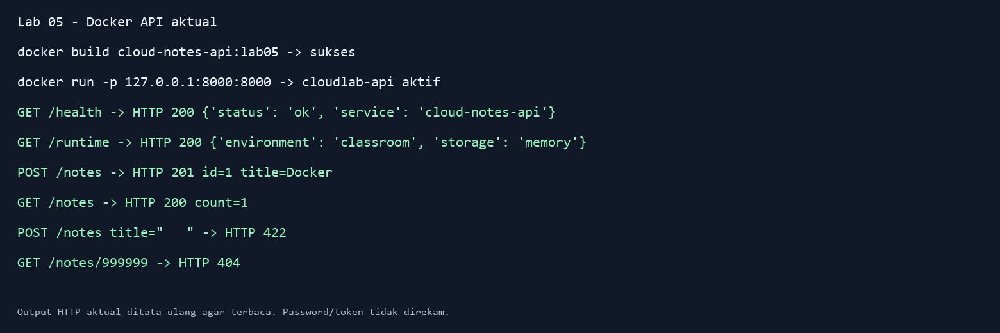

*Perintah: `docker build`, `docker run`, GET health/runtime, POST dan GET notes, lalu uji judul spasi. Cuplikan hasil Docker dan HTTP aktual ditata agar terbaca. HTTP 201 berarti catatan dibuat; HTTP 422 menunjukkan validasi; container baru mengembalikan daftar kosong karena data hanya di memori.*

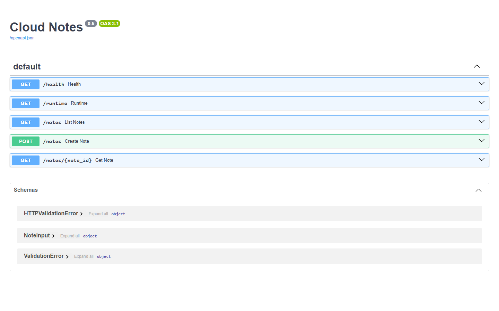

*Perintah: buka `http://127.0.0.1:8000/docs` setelah `docker run`. Browser mengambil Swagger UI dari API yang sedang hidup. Gunakan route `/health`, `/runtime`, dan `/notes` untuk membaca kontrak sebelum memanggil endpoint.*

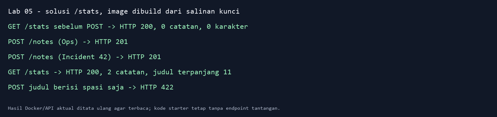

*Perintah: tambah kode `/stats` di salinan uji, build image `stats-proof`, lalu GET sebelum/sesudah dua POST. Gambar adalah hasil API aktual yang ditata agar terbaca: jumlah 0→2, judul terpanjang 11 karakter, dan input kosong HTTP 422. Starter repo tetap menyisakan tantangan untuk dikerjakan sendiri.*

### 4. Kunci lima pertanyaan analisis

1. `RUN` dan `COPY` mengubah image saat build; `CMD` dijalankan saat container start. `ENTRYPOINT` dapat menetapkan executable utama yang menerima argumen dari `CMD`; lab ini cukup dengan `CMD` Uvicorn.
2. `.dockerignore` mencegah `.env` masuk build context sehingga konfigurasi lokal tidak ikut image. File rahasia tetap harus diabaikan Git.
3. Pada `127.0.0.1:8000:8000`, bagian kiri adalah alamat dan port laptop; bagian kanan adalah port aplikasi dalam container. Loopback membatasi akses dari host lain.
4. `Field(min_length=1)` menolak string kosong. Validator tambahan `reject_blank_text` memangkas spasi dan menolak teks yang hanya berisi spasi; FastAPI memberi 422 karena payload gagal validasi.
5. `_notes` hidup di memori proses. Mengganti container membuat memori baru dan daftar kosong. Lab 06 memindahkan sumber data ke PostgreSQL dalam named volume.

## Pemeriksaan image dengan Docker Scout, opsional 5–10 menit

**Kasus kerja harian:** tim akan merilis API catatan. Build dan respons HTTP berhasil, tetapi tim masih perlu mengetahui paket apa yang ada dalam image, advisory yang terkait, serta pilihan pembaruan. Docker Scout menyusun atau membaca SBOM—daftar komponen software dan versinya—kemudian mencocokkannya dengan data kerentanan. Ini pelengkap pengujian fungsi, bukan pengganti tes API. [Konsep Scout](https://docs.docker.com/scout/)

Perumpamaan: resep adalah Dockerfile, paket bahan software adalah image, daftar bahan dan nomor batch adalah SBOM, dan Scout mencocokkannya dengan daftar recall. CVE bukan tanggal kedaluwarsa fisik; hasil scan harus dibaca bersama versi dan konteks penggunaan.

### 1. Siapkan lingkungan yang sesuai

Jalur kelas memakai **terminal Linux Codespaces** dan image `cloud-notes-api:theory-online`, yang dibuild oleh `bash scripts/demo-online.sh build`. Laptop tetap cukup browser. Docker Desktop sudah menyertakan Scout; Docker Engine di cloud belum tentu membawa plugin tersebut. Akun/login Docker dan koneksi ke layanan Scout disiapkan sebelum presentasi. Jangan menampilkan password, token, device code aktif, atau isi konfigurasi Docker. [Instalasi Scout](https://docs.docker.com/scout/install/), [quickstart](https://docs.docker.com/scout/quickstart/)

```bash
bash scripts/scout-demo.sh install
bash scripts/scout-demo.sh check
```

Script memasang binary **standalone Scout 1.26.0** secara eksplisit dan memverifikasi checksum di Linux; instalasinya berada pada cache pengguna khusus demo. Jika instalasi valid sudah ada, binary tersebut diperiksa dan dipakai ulang. Helper memakai binary ini, bukan plugin Docker CLI lain yang mungkin sudah terpasang. `check` memeriksa binary, daemon, dan image lokal, **bukan bukti login atau akses layanan**. Script tidak melakukan login, push, pengaktifan repository monitoring, atau perubahan container. Waktu unduhan dan login tidak termasuk slot demo 5–10 menit.

**Jika Anda menggunakan Docker Desktop lokal:** setelah image `cloud-notes-api:lab05` dibuild, gunakan `docker scout version`, lalu command CLI langsung pada contoh di bawah dengan target `local://cloud-notes-api:lab05`. Script installer kelas ditujukan untuk Linux, bukan PowerShell Windows. [Referensi Scout CLI](https://docs.docker.com/reference/cli/docker/scout/)

### 2. Baca ringkasan, lalu satu temuan nyata

```bash
bash scripts/scout-demo.sh quickview
bash scripts/scout-demo.sh cves
bash scripts/scout-demo.sh recommendations
```

| Command | Tujuan | Cara membaca |
|---|---|---|
| `quickview` | Ringkasan kerentanan image dan base image | Pastikan target benar; baca C/H/M/L/U sebagai critical/high/medium/low/unspecified. Angka bergantung image dan advisory saat scan. |
| `cves` | Rincian temuan menurut paket | Pilih satu temuan: nama paket, versi terpasang, CVE, severity, affected range, dan fixed version bila tercatat. |
| `recommendations` | Kandidat pembaruan base image | Baca saran dan dampaknya. Ini belum mengubah Dockerfile/image; tidak tersedia saran juga merupakan hasil yang mungkin. |

Pada Docker Desktop lokal, padanan CLI:

```bash
docker scout quickview local://cloud-notes-api:lab05
docker scout cves local://cloud-notes-api:lab05
docker scout recommendations local://cloud-notes-api:lab05
```

Target `local://` menggunakan image store lokal tanpa fallback mencari target di registry; kegiatan Scout tetap dapat membutuhkan jaringan dan autentikasi. Pada plugin Desktop, `docker scout cves --details local://cloud-notes-api:lab05` memberi rincian tambahan; jangan menambahkan flag tersebut pada helper yang hanya menerima satu nama action. [Quickview](https://docs.docker.com/reference/cli/docker/scout/quickview/), [CVEs](https://docs.docker.com/reference/cli/docker/scout/cves/), [recommendations](https://docs.docker.com/reference/cli/docker/scout/recommendations/)

<!-- scout-screenshots:start -->

**Rekaman baseline:** screenshot Scout berikut merekam image sebelum pembaruan dependency kelas, digest `c9751e34cb88`. Tag dapat digunakan ulang; digest mewakili isi image. Source repo terbaru dibuild dan dianalisis sesuai hasil aktual, sehingga total peserta dapat berbeda. Baseline membantu memahami alasan perbaikan dan perbandingan sesudahnya.

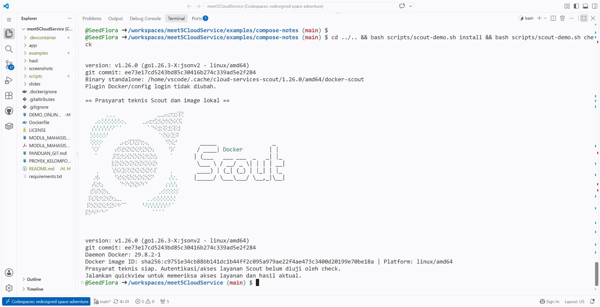

*Command: `bash scripts/scout-demo.sh install`, lalu `bash scripts/scout-demo.sh check`, dari root repo. Fungsi: menyiapkan binary standalone v1.26.0 dan memeriksa daemon/image lokal. Baca hasil aktual: Linux/amd64, image ID berawalan c9751e34cb88, serta pesan akses layanan belum diuji. Check bukan scan CVE atau bukti autentikasi.*

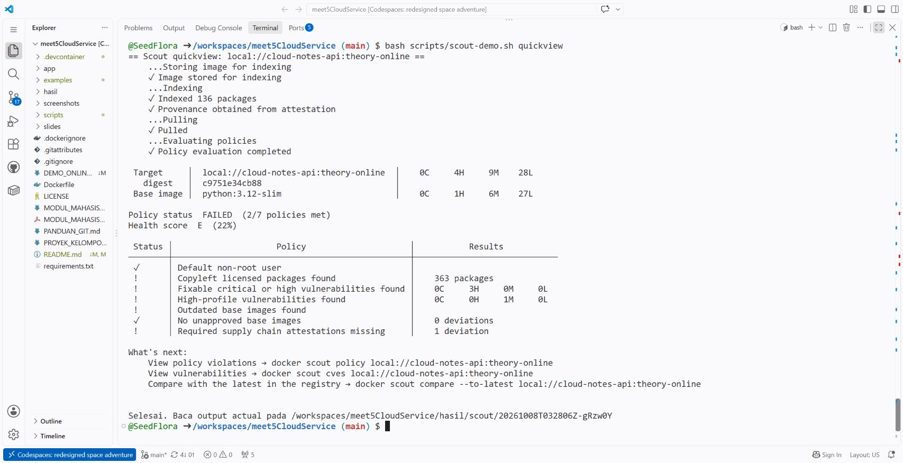

*Command: `bash scripts/scout-demo.sh quickview`. Fungsi: menghubungkan identitas image dengan ringkasan advisory. Snapshot 8 Oktober 2026 memakai local://cloud-notes-api:theory-online, digest c9751e34cb88, 136 paket diindeks, dan target 0C/4H/9M/28L. Base python:3.12-slim tampil 0C/1H/6M/27L. Angka bukan target kelulusan dan dapat berubah; tidak ada critical bukan berarti tidak ada risiko.*

Output aktual masih menampilkan **Health score 22%** dan **Policy status FAILED**. Itu bukan persentase keamanan atau nilai praktikum. Fitur health scores dan sejumlah fitur dashboard tercantum pada [pengumuman retirement Docker](https://docs.docker.com/retired/); kelas membaca paket/CVE/fix dan keputusan teknis, bukan memakai skor tersebut sebagai syarat rilis. Keberhasilan scan pada Codespace uji ini tidak menjamin akses tanpa autentikasi pada lingkungan lain.

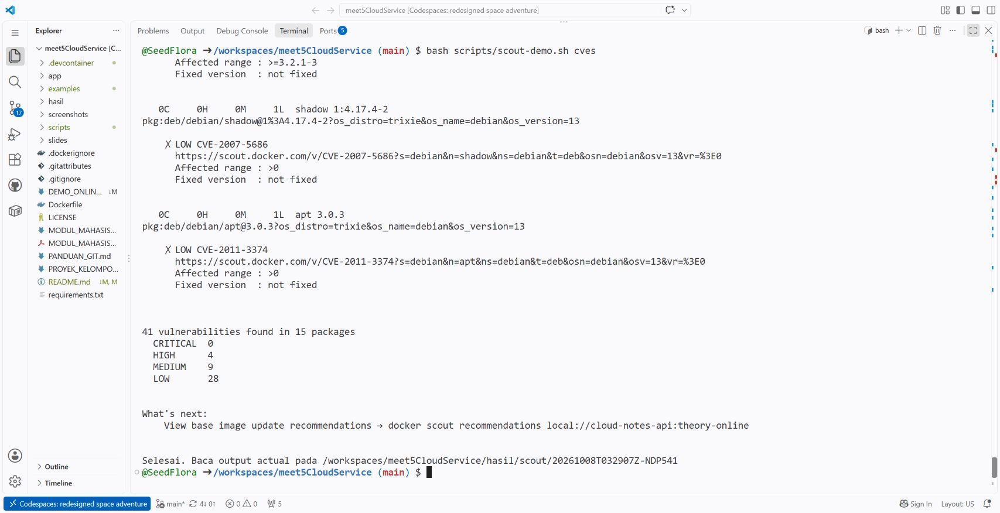

*Command: `bash scripts/scout-demo.sh cves`. Fungsi: membaca paket, versi, advisory, severity, affected range, dan fixed version. Pada cuplikan aktual: shadow 1:4.17.4-2 dengan LOW CVE-2007-5686, apt 3.0.3 dengan LOW CVE-2011-3374, keduanya not fixed. Ringkasan 0C/4H/9M/28L = 41 temuan pada 15 paket. Kunci: not fixed tidak boleh diganti dengan versi perbaikan tebakan; nilai konteks dan mitigasi, lalu pilih update yang terbukti sesuai. Potongan akhir ini tidak menampilkan empat high pada bagian lain laporan.*

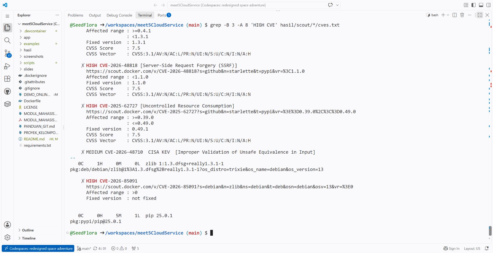

*Command rekaman: `grep -B 3 -A 8 'HIGH CVE' hasil/scout/*/cves.txt`, membaca hasil tersimpan. Bila ada banyak laporan, pilih file baseline yang sesuai metadata/digest agar tidak mencampur image. Baca output: temuan Starlette memiliki fixed version berbeda menurut advisory (1.3.1, 1.1.0, 0.49.1); zlib menampilkan high CVE-2026-85091/not fixed. Kunci: update dependency harus kompatibel dengan constraint FastAPI, lalu build image baru, tes API, dan rescan. Paket OS memerlukan review base/OS/mitigasi. Severity tidak membuktikan seluruh route aplikasi dapat dieksploitasi; periksa advisory dan konteks.*

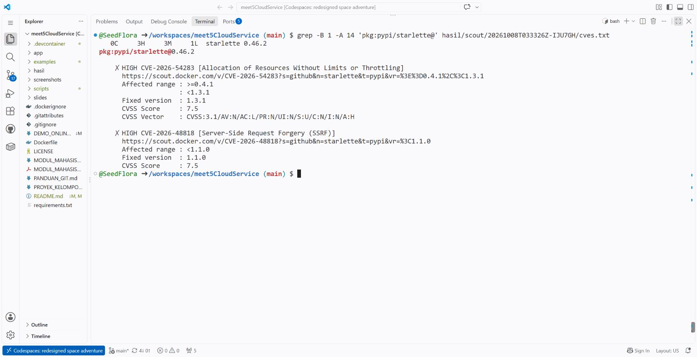

*Command rekaman: `grep -B 1 -A 14 'pkg:pypi/starlette@' hasil/scout/20261008T033326Z-IJU7GH/cves.txt`, membaca satu laporan baseline eksplisit; path mesin peserta mengikuti hasil helper. Baca: installed 0.46.2, HIGH CVE-2026-54283 affected >=0.4.1/<1.3.1 fixed 1.3.1; HIGH CVE-2026-48818 affected <1.1.0 fixed 1.1.0. Kunci: versi terpasang berada dalam rentang itu; memilih 1.1.0 belum memenuhi fix advisory pertama. Evaluasi update FastAPI/dependency yang kompatibel, verifikasi versi dalam image, tes API, lalu rescan.*

**Kunci konteks:** advisory pertama memerlukan parsing form urlencoded; yang kedua StaticFiles Windows dan mengecualikan POSIX. Contoh JSON/Linux tidak memakai fitur itu. Scan paket perlu dilengkapi tinjauan kode/config; update kompatibel tetap diuji. [Advisory form](https://github.com/Kludex/starlette/security/advisories/GHSA-82w8-qh3p-5jfq), [advisory Windows](https://github.com/Kludex/starlette/security/advisories/GHSA-wqp7-x3pw-xc5r)

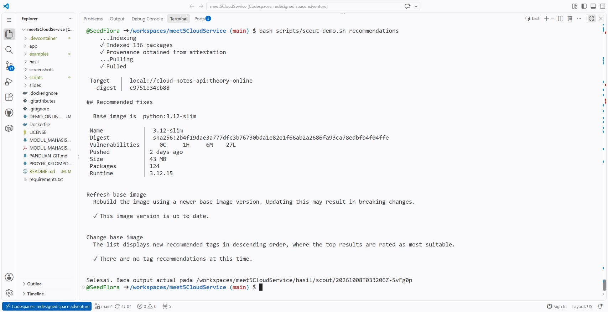

*Command: `bash scripts/scout-demo.sh recommendations`. Fungsi: meninjau opsi refresh/tag base tanpa mengubah aplikasi. Baca hasil baseline: python:3.12-slim dengan runtime 3.12.15, versi image up to date, no tag recommendations; base tetap 0C/1H/6M/27L. Kunci: tidak ada saran bukan berarti aman. Temuan dependency Starlette ditinjau melalui dependency/framework; jangan mengarang tag base baru atau mengklaim perubahan otomatis.*

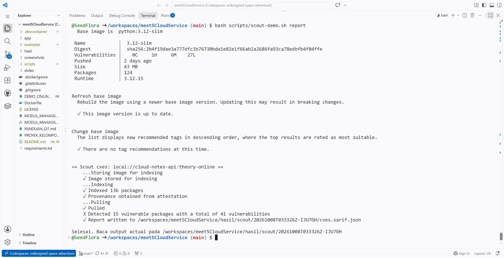

*Command: `bash scripts/scout-demo.sh report`. Fungsi: menyimpan ringkasan, rincian, rekomendasi, dan SARIF secara berurutan. Baca hasil aktual: 15 vulnerable packages/41 findings dan Report written to .../cves.sarif.json, lalu selesai. Kunci: SARIF adalah format data temuan; tersimpan bukan berarti paket diperbaiki. Metadata/output/exit code generated diabaikan Git, dapat dipakai review pribadi, tanpa kewajiban laporan lab baru.*

<!-- scout-screenshots:end -->

### 3. Kunci diskusi dan keputusan engineer

1. **Build dan HTTP 200 sudah berhasil; mengapa scan?** Itu membuktikan fungsi dasar aplikasi. Scan memeriksa komposisi software terhadap advisory yang diketahui; masalah dependency belum tentu muncul pada request pengujian.
2. **Ada severity high; langsung ganti semua versi?** Tentukan asal paket dan versi terdampaknya terlebih dahulu. Temuan dari OS/base biasanya ditangani melalui base image; temuan dependency aplikasi melalui requirements atau lockfile. Periksa ketersediaan fix, penggunaan fungsi rentan, akses jaringan, konfigurasi, dan kompatibilitas. Severity membantu prioritas, tetapi bukan satu-satunya dasar keputusan.
3. **Apa arti fixed version kosong atau `not fixed`?** Belum ada versi perbaikan yang dicatat pada data tersebut. Temuan tetap perlu dinilai; mitigasi konfigurasi, pembatasan akses, pembaruan lain, atau penggantian komponen dapat relevan. Jangan menghapus temuan agar angka menjadi nol.
4. **Filter critical/high kosong; apakah image bebas kerentanan?** Tidak ada temuan yang memenuhi filter pada cakupan dan waktu scan tersebut. Baca laporan lengkap; jangan menyamakan filter kosong dengan scan tanpa temuan atau jaminan keamanan.
5. **`recommendations` memberi base baru; apa langkah berikutnya?** Periksa bahwa runtime/platform/dependency kompatibel, ubah `FROM` bila sesuai, rebuild image, buat container baru, jalankan health dan alur POST/GET/validasi, lalu scan ulang. Rebuild tidak otomatis mengganti container lama.
6. **Bagaimana jika total CVE menjadi 0?** Artinya tidak ada kerentanan yang terdeteksi oleh data dan cakupan scan itu. Tetap periksa fungsi, secret, konfigurasi, izin, exposure jaringan, dan risiko yang belum dikenal; 0 bukan sertifikat aman.
7. **Plugin, login, atau backend gagal; apakah hasilnya 0?** Belum ada hasil scan yang valid. Selesaikan prasyarat atau gunakan rekaman aktual yang berlabel image/digest dan waktu. Kegagalan layanan Scout berbeda dari kegagalan API.

Setiap action scan menyimpan output dan exit code pada `hasil/scout/<waktu-UTC>-<acak>/`. Untuk rangkaian laporan lengkap, jalankan `bash scripts/scout-demo.sh report`. Rangkaian ini mencoba `quickview.txt`, `cves.txt`, `recommendations.txt`, lalu `cves.sarif.json` dan `cves-sarif.console.txt`; `metadata.txt` mencatat target dan status. Proses berhenti pada kegagalan pertama, jadi folder dapat berisi laporan parsial. Folder generated diabaikan Git. Laporan parsial atau gagal tidak boleh diberi label lulus; exit 0 sendiri juga tidak menyatakan bebas kerentanan. Tidak ada kewajiban mengumpulkan laporan lab baru. [Analisis Scout](https://docs.docker.com/scout/explore/analysis/)

### 4. Kunci perbaikan dan bukti sesudah update

Source API utama telah diperbarui ke **FastAPI 0.142.4/Uvicorn 0.54.0**; build kelas resolve **Starlette 1.7.0**. Verifikasi versi dalam image, karena pin dependency langsung tidak mengunci seluruh paket transitif. Regresi lokal API + solusi stats meluluskan **21/21 pemeriksaan**. API tetap JSON/Linux, UID 10001, dan memori; perbaikan dependency tidak menjadikannya database.

Dari root repo pada terminal Linux, setelah memakai source terbaru:

```bash
bash scripts/demo-online.sh stop
bash scripts/demo-online.sh start
bash scripts/demo-online.sh test --restart
docker exec cloudlab-theory-online python -c \
  'import fastapi, starlette, uvicorn; print("VERSIONS", fastapi.__version__, starlette.__version__, uvicorn.__version__)'
docker tag cloud-notes-api:theory-online cloud-notes-api:scout-improved
SCOUT_IMAGE=cloud-notes-api:scout-improved bash scripts/scout-demo.sh quickview
SCOUT_IMAGE=cloud-notes-api:scout-improved bash scripts/scout-demo.sh cves
```

**Kunci command:** stop/start membuat container demo berlabel dari source baru; catatan memori hilang. `test --restart` membuktikan fungsi HTTP serta perilaku reset; versi dibaca melalui Python dalam container. `docker tag` menambahkan nama lokal image yang sama, tidak upload. `SCOUT_IMAGE` memilih target scan; default helper tetap theory-online. Snapshot memakai host 8000; port alternatif pada wrapper harus konsisten. Pengajar menyimpan baseline sebagai scout-before sebelum rebuild; peserta tidak perlu menurunkan dependency untuk meniru baseline.

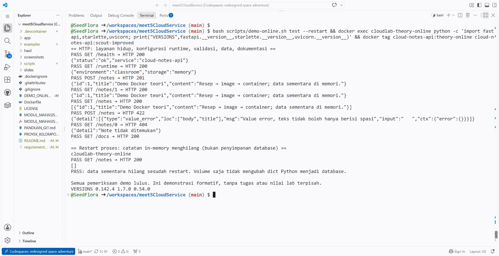

*Command: test --restart, docker exec pemeriksaan versi, docker tag kandidat. Fungsi: membuktikan perubahan tetap menjalankan health/runtime/create/read/validasi/missing/docs dan memori hilang setelah restart. Baca hasil aktual: PASS, daftar [], VERSIONS 0.142.4/1.7.0/0.54.0 dalam urutan FastAPI/Starlette/Uvicorn. Field API utama environment/storage memory berbeda dari app_env/storage postgres pada Compose.*


*Command: `SCOUT_IMAGE=cloud-notes-api:scout-improved bash scripts/scout-demo.sh quickview`. Fungsi: memeriksa artefak baru, digest 39d3c08210c2. Hasil aktual: 138 paket diindeks, target/base 0C/1H/6M/27L; baseline digest c9751e34cb88 berjumlah 136 paket dengan 0C/4H/9M/28L. Angka ini snapshot 8 Oktober 2026. Legacy health 67% bukan persentase keamanan/nilai kelas.*

**Kunci keputusan akhir:** pembaruan menurunkan temuan dan tes fungsi tetap lulus, tetapi satu high masih perlu review advisory/fix/konteks/mitigasi. Jumlah paket yang naik tidak otomatis menaikkan risiko; baca paket/versi dan hasil rinci. Tetap periksa konfigurasi, secret, akses, dan risiko yang belum terdeteksi. [Alur lengkap beserta perbandingan](DEMO_ONLINE.md#115-perbaikan-yang-dijalankan-update--tes--scan-ulang) menjelaskan versi, tag, dan batas bukti; bukan tugas tambahan.

<!-- scout-improved-details:start -->

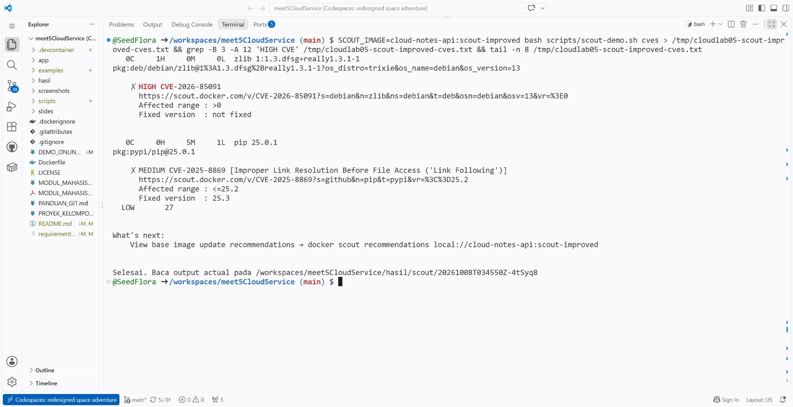

*Command: `SCOUT_IMAGE=cloud-notes-api:scout-improved bash scripts/scout-demo.sh cves > /tmp/cloudlab05-scout-improved-cves.txt`, dilanjutkan `grep -B 3 -A 12 'HIGH CVE' ...` dan `tail -n 8 ...` dengan && seperti blok lengkap pada [panduan online](DEMO_ONLINE.md#screenshot-scout-8-temuan-high-yang-masih-tersisa). Fungsi: baca rincian residual dari scan target yang benar. Hasil: zlib Debian 1:1.3.dfsg+really1.3.1-1, HIGH CVE-2026-85091, affected >0, not fixed. Tiga high Starlette baseline telah berkurang; dependency Python update tidak memperbaiki OS otomatis.*

**Kunci residual risk:** catat digest/tanggal/advisory serta konteks penggunaan, review catatan distro/upstream dan mitigasi, lalu rencanakan follow-up. Versi Debian mempunyai epoch/revisi; jangan membandingkan string itu secara naif dengan versi upstream atau menebak versi fix. [Tracker Debian](https://security-tracker.debian.org/tracker/CVE-2026-85091) masih mencatat unfixed pada tinjauan ini. Hasil 0C/1H/6M/27L serta tes fungsi PASS tetap perlu keputusan risiko yang sesuai untuk rilis kerja; demo kelas menggunakan data dummy.

<!-- scout-improved-details:end -->

## Jembatan ke aplikasi tiga layanan

Ikuti [demo Compose lengkap](COMPOSE_DEMO.md) untuk melihat frontend mengirim request ke FastAPI dan FastAPI menyimpan catatan pada PostgreSQL. Panduan mencakup command config/build/run/status/logs, web, pengujian HTTP, pembuktian persistensi, cleanup yang mempertahankan volume, serta kunci semua pertanyaan diskusi. Ini contoh terpisah menuju Lab 06; starter API memori dan kunci `/stats` di atas tetap menggunakan perilaku memori.

Setelah tiga service sehat, jalankan `bash scripts/smoke.sh` dari **examples/compose-notes**. Python pemeriksa berjalan di container API dan menguji URL internal web/proxy. Sembilan pemeriksaan mencakup GET 200, POST 201, judul kosong 422, ID tidak ditemukan 404, serta DELETE 204 untuk catatan sementara yang baru dibuat script. Kunci: 422/404 dapat menjadi PASS ketika sengaja diharapkan; `finally` mencoba membersihkan hanya ID hasil POST sendiri. Catatan dosen tetap tersedia untuk bukti persistensi. [Bagian smoke script](COMPOSE_DEMO.md#62-ulangi-pemeriksaan-dengan-smoke-script) memuat tabel lengkap, cara membaca error, dan screenshot aktual 9/9 PASS; ini latihan bersama, bukan tugas tambahan.

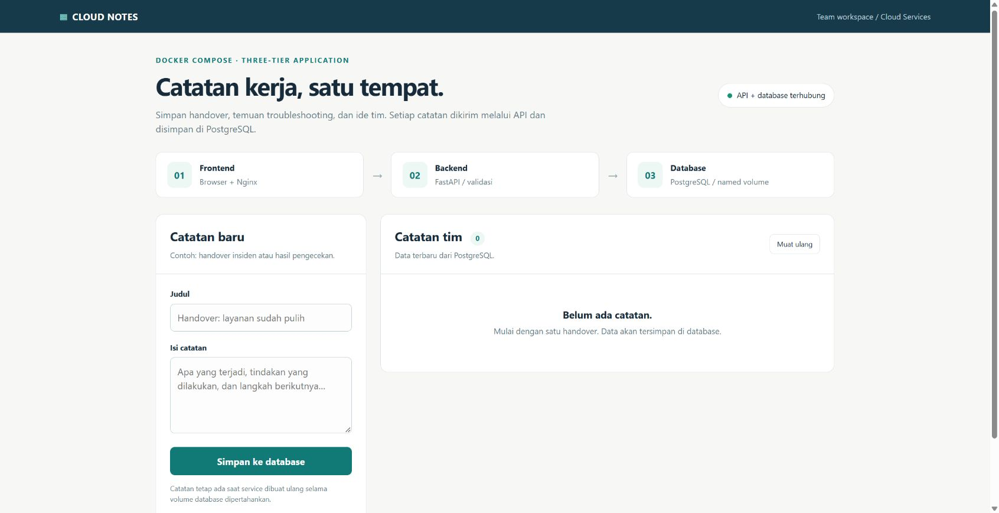

*Langkah: dari `examples/compose-notes`, jalankan `docker compose up -d --build --wait`, lalu buka frontend melalui URL Ports. Default web 13006/API 13005; screenshot online memakai web 13106/API 13105. Frontend relatif `/api/*` diteruskan Nginx ke backend dan PostgreSQL; tanda terhubung harus dilengkapi tes HTTP serta simpan/baca.*


*Langkah: isi judul/isi, lalu klik Simpan ke database. Screenshot aktual memakai data dummy Handover: layanan checkout pulih. Backend menyimpan melalui POST lalu frontend membaca daftar kembali. Panduan Compose melanjutkan ke pembuktian SQL/persistensi dan cleanup, bukan menganggap tampilan UI sebagai satu-satunya bukti.*

## Tutup lingkungan online setelah semua percobaan

Dari folder `examples/compose-notes`, `docker compose down` menghentikan project tanpa menghapus named volume. Kembali ke root dengan `cd ../..`, lalu `bash scripts/demo-online.sh stop` membersihkan container memori milik demo. Sesudah itu pilih **Stop codespace** pada halaman Codespaces; ini menghentikan compute. Menutup tab atau hanya down container belum menghentikan mesin cloud.

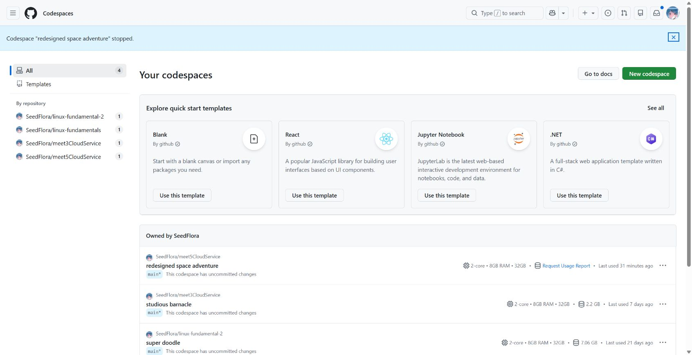

*Langkah: github.com/codespaces → menu … lingkungan kelas → Stop codespace. Fungsi: menghentikan compute. Bukti aktual: banner Codespace redesigned space adventure stopped. Storage tetap dihitung selama disimpan; Stop menyimpan lingkungan dan perubahan lokal. Sebelum Delete, simpan/push kode yang perlu dipertahankan dan backup data penting, karena Delete menghilangkan data lokal. Generated reports/.env tidak ikut dipush secara otomatis.*
