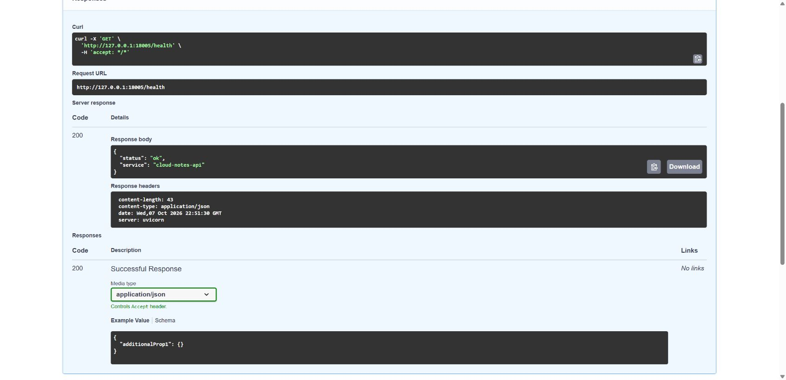

# Lab 05 — Dockerfile untuk Cloud Notes API

<!-- lecture-materials:start -->

## Materi teori sebelum praktikum

- [Pertemuan 05: Docker Core](slides/Teori_Pertemuan_05.pptx)
- [Kode contoh teori Node.js 24: satu stage dan multi-stage](examples/theory-node/README.md)
- [Demo Docker penuh di browser, dengan screenshot setiap tahap](DEMO_ONLINE.md)
- [PDF panduan demo online](DEMO_ONLINE.pdf)
- [Demo Compose: frontend + backend + PostgreSQL](COMPOSE_DEMO.md)
- [PDF panduan Compose](COMPOSE_DEMO.pdf)
- [Docker Scout opsional 5–10 menit: membaca temuan dan memilih tindakan](DEMO_ONLINE.md#11-docker-scout-opsional-510-menit)
- [Kredit foto dan sumber perumpamaan pada PPT](slides/SUMBER_GAMBAR.md)

Slide menghubungkan konsep, kasus kerja, bacaan/video resmi, dan langkah lab. Revisi 8 Oktober 2026 menambahkan perumpamaan restoran dengan foto berlisensi serta 14 screenshot alur demo Codespaces. Contoh FastAPI telah dibangun dan diuji end to end di Codespaces melalui Chrome; kedua contoh Node.js telah dibangun dan diuji lokal.

<!-- lecture-materials:end -->

**Kebijakan kelas:** Lab ini latihan formatif, tanpa tugas, nilai, atau penyerahan terpisah. Satu proyek besar dikerjakan oleh kelompok **3 orang**, dengan presentasi checkpoint minggu 7 (UTS) dan hasil akhir minggu 14 (UAS). Simpan hasil lab hanya bila berguna sebagai referensi atau bukti proses proyek. Baca [brief proyek kelompok](PROYEK_KELOMPOK.md). Bobot resmi tetap mengikuti RPS/LMS.

Repo template: [SeedFlora/meet5CloudService](https://github.com/SeedFlora/meet5CloudService). [Modul mahasiswa](MODUL_MAHASISWA.md) memuat screenshot, jawaban analisis, dan kunci lengkap tantangan `/stats`; [panduan Git](PANDUAN_GIT.md) dipakai dari root repo pribadi. Versi cetak: [PDF mahasiswa](MODUL_MAHASISWA.pdf). Slide kelas ada di `slides/`.

**Capaian:** menulis Dockerfile multi-stage, mengecilkan build context dengan `.dockerignore`, memberi tag image, menjalankan image dengan environment variable, dan menguji REST API. Data lab ini sementara tersimpan di memori; Lab 06 menambahkan database.

## Mulai di komputer kampus Windows

Buka Docker Desktop dan tunggu **Linux Engine** siap. Pada PowerShell, periksa `git --version`, `docker version` (Client + Server), dan `docker info --format '{{.OSType}}'` (linux). Untuk PC yang belum mempunyai repo:

```powershell
$campusFolder = Join-Path ([Environment]::GetFolderPath('MyDocuments')) 'CloudServices'
New-Item -ItemType Directory -Path $campusFolder -Force | Out-Null
Set-Location -LiteralPath $campusFolder
git clone https://github.com/SeedFlora/meet5CloudService.git
Set-Location -LiteralPath 'meet5CloudService'
Get-ChildItem -LiteralPath 'Dockerfile', 'requirements.txt', 'app/main.py'
```

Lanjutkan build dari folder tersebut. Jika repo sudah ada, periksa `git status --short` dan gunakan `git pull --ff-only` hanya saat bersih; [modul mulai dari PC kampus](MODUL_MAHASISWA.md#mulai-dari-komputer-kampus-windows) menjelaskan langkah, hasil, dan troubleshooting. Clone tidak memerlukan `git init`; remote ini milik pengajar, sehingga simpan perubahan lokal atau pilih [repo kelompok/pribadi](PANDUAN_GIT.md) sebelum push. Build pertama memerlukan internet. Jika instalasi/Engine dibatasi pengelola PC, gunakan demo online berikut dengan browser.

Rujukan resmi: [clone repo GitHub](https://docs.github.com/en/repositories/creating-and-managing-repositories/cloning-a-repository), [instalasi Docker Compose](https://docs.docker.com/compose/install/).

## Demo teori tanpa instalasi di laptop

Buka repo ini, lalu **Code → Codespaces → Create codespace on main**. Gunakan mesin **2 core** dan tunggu terminal Linux siap. Docker dipasang di mesin cloud oleh konfigurasi repo; laptop hanya memerlukan browser, akun GitHub, internet, dan kuota Codespaces.

Jalankan command satu per satu:

```bash
bash scripts/demo-online.sh check
bash scripts/demo-online.sh build
bash scripts/demo-online.sh start
bash scripts/demo-online.sh status
bash scripts/demo-online.sh test
```

Buka tab **Ports**, pilih **8000**, pertahankan **Private**, lalu **Open in Browser** dan tambahkan `/docs`. Swagger menyediakan tombol **Try it out → Execute** untuk GET `/health`, POST `/notes`, dan GET `/notes`. `localhost` pada terminal menunjuk mesin cloud; browser laptop memakai URL forwarded dari Ports.

Setelah demo:

```bash
bash scripts/demo-online.sh test --restart
bash scripts/demo-online.sh stop
```

Restart mengosongkan catatan memori pada contoh ini. Selanjutnya buka [Codespaces](https://github.com/codespaces), pilih menu **… → Stop codespace** pada lingkungan kelas. Compute berhenti; storage tetap dihitung selama lingkungan disimpan. Kuota gratis terbatas. [Panduan bergambar](DEMO_ONLINE.md) menjelaskan arti setiap command, hasil aktual, troubleshooting, serta jalur cadangan Killercoda.

## Demo Compose: aplikasi dengan tiga layanan

[Panduan Compose](COMPOSE_DEMO.md) menunjukkan frontend Nginx, backend FastAPI, dan database PostgreSQL bekerja bersama. Ini jembatan menuju Lab 06 dan proyek kelompok; API utama Lab 05 tetap menggunakan memori supaya perbedaan persistensi dapat diamati.

Dari root repo, jalankan di terminal Linux Codespaces:

```bash
cd examples/compose-notes
cp .env.example .env
```

Defaultnya API **13005** dan frontend **13006**. Screenshot online kelas memakai alternatif **13105/13106**, karena 13005 sudah dipakai proses lain yang tidak diubah. Untuk mengikuti alamat pada screenshot, setelah menyalin `.env` jalankan pada terminal Linux:

```bash
sed -i 's/^API_PORT=.*/API_PORT=13105/; s/^WEB_PORT=.*/WEB_PORT=13106/' .env
```

Lalu jalankan:

```bash
docker compose config --quiet
docker compose up -d --build --wait
docker compose ps
bash scripts/smoke.sh
```

`bash scripts/smoke.sh` dari folder Compose melakukan sembilan pemeriksaan HTTP melalui web → API → PostgreSQL, termasuk create/read, input ditolak, ID tidak ditemukan, dan penghapusan hanya catatan uji sementara. Python berjalan di container API; host tidak perlu Python. [Panduan Compose](COMPOSE_DEMO.md#62-ulangi-pemeriksaan-dengan-smoke-script) menjelaskan setiap status, fungsi `request`, dan cleanup `try`/`finally`; pengujian aktual Codespaces menghasilkan 9/9 PASS.

Buka port host dari `.env` melalui tab Ports: frontend **13006** dan API **13005** secara default, atau **13106/13105** jika memakai alternatif screenshot. Tambahkan `/docs` pada URL API. Database **tidak** memublikasikan port 5432 ke host. Frontend meneruskan request `/api/*` ke service `api`, dan backend terhubung ke service `db` menggunakan DNS network Compose. Setelah membuat catatan, `docker compose down` lalu `docker compose up -d --wait` menunjukkan data tetap ada karena disimpan di PostgreSQL pada named volume. `down` mempertahankan volume; jangan menambahkan `-v` pada alur demo.


*Screenshot aktual Codespaces 8 Oktober 2026, frontend port 13106. Catatan dummy dibuat dari form; [panduan Compose](COMPOSE_DEMO.md) menjelaskan command, jalur request, bukti database, persistensi, dan cleanup.*

## Docker Scout: pemeriksaan sebelum rilis, opsional 5–10 menit

Setelah build dan tes API berhasil, [alur Scout beserta kunci diskusi](DEMO_ONLINE.md#11-docker-scout-opsional-510-menit) memperlihatkan ringkasan image, rincian CVE, dan saran base image. Perumpamaannya: Scout mencocokkan daftar bahan software dengan advisory atau daftar recall; pengujian API tetap diperlukan setelah mengganti bahan.

Dari root repo di terminal **Linux Codespaces**, siapkan CLI standalone dan login Docker sebelum presentasi. Jalankan `bash scripts/scout-demo.sh install` secara eksplisit, lalu `bash scripts/scout-demo.sh check`; instalasi yang sudah valid akan diperiksa dan dipakai ulang. `check` memeriksa binary, daemon, dan image, **belum membuktikan login atau akses layanan**. Sesudah image `cloud-notes-api:theory-online` dibuild:

```bash
bash scripts/scout-demo.sh quickview
bash scripts/scout-demo.sh cves
bash scripts/scout-demo.sh recommendations
```

Script memakai `local://cloud-notes-api:theory-online`; targetnya image API utama Lab 05, **bukan image API Compose**. Scout mengakses layanan online dan dapat memerlukan akun atau hak akses Docker. Demo ini tidak memerlukan push image atau pengaktifan monitoring registry. Hasil 0 atau filter kosong bukan jaminan aplikasi aman. Pilih perbaikan berdasarkan paket, versi, fix, serta konteks penggunaan; rebuild, uji HTTP, lalu scan ulang. Ini observasi formatif bersama, tanpa tugas atau nilai tambahan.

Analisis baseline pada Codespaces **8 Oktober 2026**, Scout **1.26.0**, digest pendek **c9751e34cb88**, menghasilkan **0 critical, 4 high, 9 medium, 28 low** sebelum perbaikan dependency kelas. Rincian dan screenshot ada pada panduan; source terbaru serta advisory dapat menghasilkan angka berbeda. Health score/policy legacy yang masih tampil tidak dipakai sebagai persentase keamanan atau nilai kelas.

Source terbaru memakai **FastAPI 0.142.4/Uvicorn 0.54.0**, dengan **Starlette 1.7.0** terverifikasi pada build kelas. Regresi lokal API/stats **21/21 PASS** dan helper HTTP/reset memori Codespaces PASS. Scan ulang tag **cloud-notes-api:scout-improved**, digest **39d3c08210c2**, memberi **0 critical, 1 high, 6 medium, 27 low**, 138 paket diindeks. [Panduan perbaikan bergambar](DEMO_ONLINE.md#115-perbaikan-yang-dijalankan-update--tes--scan-ulang) memuat command build/recreate/test/tag/scan dan kunci residual risk; hasil masih memerlukan review, bukan jaminan keamanan.

## Jalankan secara lokal

Dari root repo Lab 05:

```bash
docker build -t cloud-notes-api:lab05 .
docker image ls cloud-notes-api
docker run --name cloudlab-api -d -p 127.0.0.1:8000:8000 -e APP_ENV=classroom cloud-notes-api:lab05
docker logs cloudlab-api
```

Buka `http://127.0.0.1:8000/docs` untuk mencoba OpenAPI. Uji lewat PowerShell:

```powershell
Invoke-RestMethod http://127.0.0.1:8000/health
Invoke-RestMethod http://127.0.0.1:8000/runtime
Invoke-RestMethod http://127.0.0.1:8000/notes -Method Post -ContentType application/json -Body '{"title":"Docker","content":"Image adalah template; container adalah proses."}'
Invoke-RestMethod http://127.0.0.1:8000/notes
```

Atau bash:

```bash
curl -fsS http://127.0.0.1:8000/health
curl -fsS -X POST http://127.0.0.1:8000/notes -H 'Content-Type: application/json' -d '{"title":"Docker","content":"Image adalah template; container adalah proses."}'
curl -fsS http://127.0.0.1:8000/notes
```

Uji validasi dengan judul kosong: API seharusnya mengembalikan HTTP 422. Lalu hentikan/hapus container dan jalankan ulang; catatan akan hilang karena masih berada di memori.

```bash
docker rm -f cloudlab-api
```

## Hal yang diamati

- `COPY` dipakai untuk berkas lokal; `ADD` punya kemampuan ekstra seperti ekstraksi arsip yang tidak diperlukan di sini.
- Tahap `builder` memasang dependency ke virtual environment; tahap `runtime` hanya membawa dependency dan kode.
- `USER appuser` mencegah proses aplikasi berjalan sebagai root.
- Tag `lab05` memberi versi yang dapat disebut jelas saat demo.

**Git opsional:** commit kode dan Dockerfile. Untuk push ke Docker Hub, buat akun dan jalankan `docker tag cloud-notes-api:lab05 NAMA_AKUN/cloud-notes-api:lab05`, `docker login`, `docker push NAMA_AKUN/cloud-notes-api:lab05`. Simpan kode di GitHub; push image ke registry hanya bila dipakai untuk menjalankan proyek.

Rujukan: [Dockerfile reference](https://docs.docker.com/reference/dockerfile/), [multi-stage builds](https://docs.docker.com/build/building/multi-stage/).

## Bukti pengujian kelas 8 Oktober 2026

FastAPI berhasil dibangun dan diuji: `/health`, `/runtime`, dan `/docs` 200; POST `/notes` 201; input kosong 422; ID tidak ditemukan 404. Proses memakai UID 10001. Sesudah `docker restart`, catatan memori kosong kembali. Kedua contoh Node.js juga berhasil dibangun dan diuji; contoh multi-stage memakai UID 1000.

Screenshot berikut diambil langsung dari Swagger di Chrome. Uji ini memakai port host **18005** untuk menghindari benturan; port container tetap **8000**. Langkah utama modul memakai host **8000**. Di `/docs`, buka GET `/health`, klik **Try it out**, lalu **Execute**.



Perintah yang setara pada Bash: `curl -i http://127.0.0.1:18005/health`; pada Windows: `curl.exe -i http://127.0.0.1:18005/health`. `-i` menampilkan header dan body. HTTP 200 dengan `status: ok` menunjukkan endpoint API dapat diakses; ini belum memeriksa database. Uji membutuhkan container berjalan pada mapping port tersebut.
